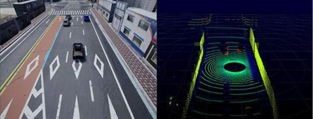

# Label-to-Image Translation 연구의 장단점
**{요약부}**

안녕하세요. MORAI SIM의 센서 모듈을 기획 및 개발하며, Virtual Dataset 구축을 담당하고 있는 임호준입니다.

본 포스팅에서는 Label-to-Image Translation(Semantic-GT to Real-RGB)을 수행한 결과를 공유드리며, 해당 연구를 인지 학습 데이터셋 구축에 적용했을 때의 장단점에 대해 알아보고자 합니다.

## 들어가며
**{서론부}**

Label-to-Image Translation 연구는 MORAI Dataset의 Photorealism 향상을 위해 수행한 카메라 센서 기반의 Image-to-Image Translation(Synthetic-RGB o Real-RGB) 연구의 일부 과제로 시작하게 되었습니다.

우선 Label-to-Image Translation이란 무엇이고 인지 학습 데이터셋에 어떻게 활용되며 활용했을 때의 장점은 무엇인지 알아보겠습니다.

???+ example "주요 용어"
    - Label-to-Image translation: Semantic segmentation GT로부터 그에 대응하는 원본 RGB 이미지를 복원하는 task.
    - Source: Semantic segmentation GT
    - Target: 원본 RGB 이미지
    - Translated source: 딥러닝 모델이 Source 이미지 한장을 input으로 하여 생성한 output(Target과 유사하도록 생성하는 것이 목표)

### Label-to-Image Translation 이란
Source가 semantic mask(ground-truth)이고 Target이 semantic mask에 대응하는 RGB 이미지인 경우를 의미.
즉, 일반적인 정변환 하는 것이 아닌 역변환을 학습하는 것이 목표인 task.

<figcaption><b>
그림 1. MORAI SIM 라이다 센서로 검출한 점군 형태의 정답 데이터
</b></figcaption>

  - 정변환: RGB image를 input으로 받았을 때, 이에 대응하는 semantic mask를 예측
  - 역변환: semantic mask가 주어졌을 때, 그에 대응하는 RGB image를 예측

 
### Label-to-Image Translation 활용 분야
일반적으로 Label-to-Image Translation를 인지 학습 데이터에는 어떻게 활용되며 활용했을 때 장점은 ~~ 입니다.

## Label-to-Image Translation 연구 배경
**{본론1}**
Label-to-Image Translation’  연구를 하게 된 배경은 무엇인가요? 이 연구가 왜 필요했는지 설명해주세요. 연구를 하기에 앞서 겪었던 문제는 무엇이었나요?
겪었던 문제가 없없다면 연구가 필요했던 이유 중심으로 설명 부탁드립니다.

## 연구 방안 및 계획
**{본론2}**
연구를 하기 위해 준비했던 일들을 설명해주세요.

PPT 자료에서 소개한 논문(DECENT: Unpaired Image-to-Image Translation with Density Changing Regularization) 을 설명해주시는 것도 좋을 것 같습니다.

## 연구 진행 순서 및 방법
**{본론3}**

실제로 연구를 진행한 단계 별 방법을 절차대로 작성해주세요.

## 연구 결과
**{본론4}**

 - 연구 결과를 수치 및 사실 중심으로 작성해주세요.  
 - 실제 연구 결과는 예상했던 결과 대비 어떠했나요? 
 - 연구 결과로 무엇을 증명할 수 있었고 어떻게 활용해볼수 있을까요?

## 마치며
**{결론}**

결론에서는 본론 초반에서 제기한 문제를 다시 한번 상기시키며 이를 해결하기 위한 연구 방법, 결과를 요약하고 강조합니다. 끝으로 독자에게 간단한 조언을 남기며 마무리합니다.

본 연구를 하게 된 계기는 ~가 필요하단 거였고 Label-to-Image Translation 연구를 통해 해결해볼 수 있었습니다. 

Label-to-Image Translation은 기본적으로 ill-posed problem이기에, 아직 연구할 부분이 많습니다. 그러나 Static object 및 Scene에 대한 합성 qaulity는 높기에 Label-to-Image와 Image-to-Image translation을 융합하는 방식으로 고도화가 가능할 것이라고 기대합니다.

저희와 같이 인지 학습 데이터를 연구하시는 분들께 본 포스팅에서 다룬 Label-to-Image Translation 연구 방법 및 결과가 도움되시길 바라며 이만 마치도록 하겠습니다. 감사합니다.

