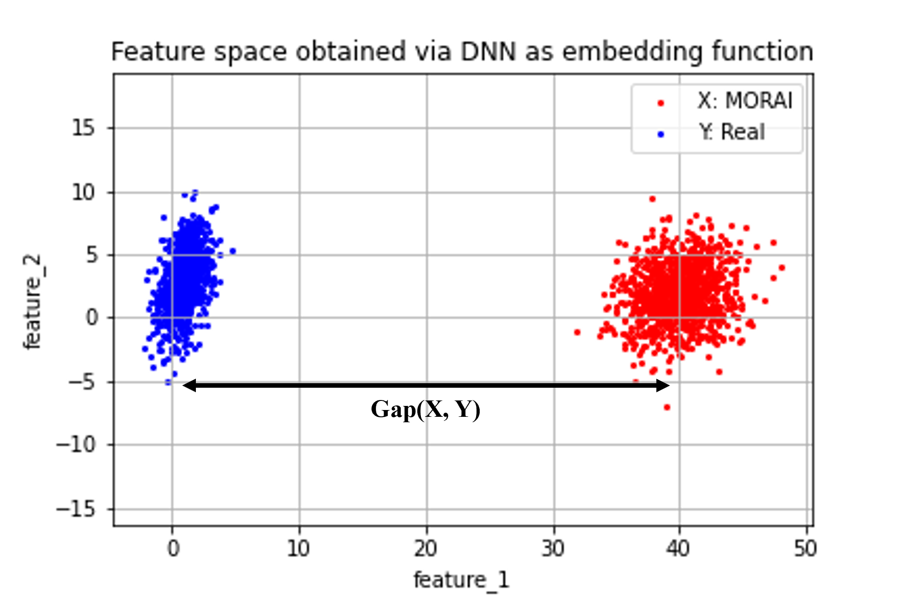
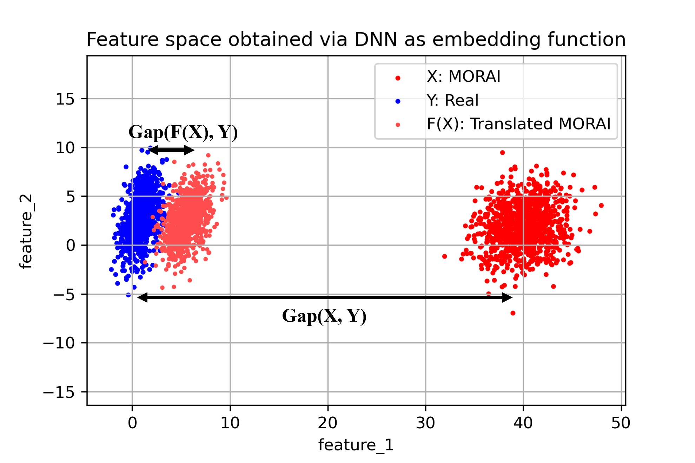

# MORAI 데이터셋을 활용한 Image-to-Image Translation 연구
안녕하세요. AI 기술을 연구하며  MORAI SIM의 Virtual 데이터셋 개발을 담당하고 있는 임호준입니다.

본 포스팅에서는 자율주행 인지 모델 학습에 필요한 데이터셋을 구축하기 위하여  MORAI SIM의 데이터셋을 활용한 Image-to-Image Translation 연구를 수행한 내용을 전달드리고자 합니다.
 

---
### 🍀 용어 설명 
본문에서 언급되는 주요 기술 용어는 아래와 같습니다.

<pre>
  ◾ <b>Image-to-Image Translation(I2I)</b>: 가상 이미지를 현실 이미지로 변환하는 기술로 ‘Simulation to Real World(Sim2Real)’ 또는’Synthetic-RGB to Real-RGB’ Translation 라고도 부름

  ◾ <b>Source Domain</b>: I2I 연구에 사용한 원본 데이터만 존재하는 집합. 본 포스팅에 한해 Source Domain을 Synthetic 데이터가 존재하는 집합(데이터셋)으로 정의함. 
        예:  GTA5, SHIFT, Virtual KITTI Dataset

  ◾ <b>Source Image</b>: Source Domain에서 추출한 임의의 원본 이미지

  ◾ <b>Target Domain</b>:  I2I 연구에서 목표로 하는 타겟 데이터만 존재하는 집합. 본 포스팅에 한해 Target Domain을 현실의 Real 데이터가 존재하는 집합(데이터셋)으로 정의함.
        예: Cityscapes, nuScenes, BDD100K Dataset

  ◾ <b>Target Image</b>: Target Domain에서 추출한 임의의 타겟 이미지

  ◾ <b>Translated Image</b>: Source Image를 Target Image Style로 변환하는 I2I 모델 <i>F</i>가 있다고 간주할 때, <i>F</i>에 의해 변환된 출력 이미지
  
  ◾<b>Domain</b>: 동일한 수준별로 분류한 특정 집합. 본 포스팅에서는 크게 가상(Synthetic) 도메인과 현실(Real) 도메인이 있고, 각 도메인 내 해당 데이터가 속한 환경 요인에 따라 하위 도메인으로 분류할 수 있음.
        예: 시간대에 따른 밤 도메인과 낮 도메인, 지리에 따른 도심 도메인, 시골 도메인

  ◾ <b>Domain Gap</b>: 두개 혹은 그 이상의 서로 다른 Domain에 속한 데이터 간의 차이
</pre>

## 1. 들어가며
본론에 들어가기에 앞서, 본 포스팅의 주제인 Image-to-Image Translation (**I2I**)란 무엇이고, 기계 학습 분야 나아가서는 자율 주행의 인지 모델의 학습에는 어떻게 활용되는지 알아보겠습니다.

### 1.1 Image-to-Image Translation(I2I) 이란

**Image-to-Image Translation(I2I)** 는 서로 다른 도메인에 속하는 이미지 간의 변환 기술입니다.  
I2I는 Source Image의 내용(Content)은 유지하되 스타일(Style)을 바꾸는 연구에 주로 활용되므로 Style-Transfer(ST)라고도 불립니다.

**그림 1.** 과 같이 Source Domain $X$에 속하는 Source Image가 Target Domain $Y$에 속하는 Target Image처럼 보이도록 I2I를 수행하면, 결과적으로 맨 우측의 Translated Image를 생성하게 됩니다.
{:onclick="window.open(this.src)" title="Click view screen" width="100%"}
<figcaption> 그림 1. I2I 예시 </figcaption>

I2I의 목표는 Source Image $I^{X}$가 주어졌을 때, Target Image $I^{Y}$와 유사한 Translated Image, $I^{X \rightarrow Y}$를 생성하는 것입니다. 이를 수식으로 표현하면 다음과 같습니다.

> $F(I^{X}) = I^{X \rightarrow Y } \approx I^{Y}$ 
>  
>  - $X$: Source Domain
>  - $Y$: Target Domain
>  - $I^{X}$: I2I 모델의 입력으로 사용하는 임의의 Source Image(원본 이미지)
>  - $I^{Y}$: I2I 모델의 목표 대상으로 출력하는 임의의 Target Image(타겟 이미지)
>  - $F$: I2I를 수행하는 딥러닝 모델, 입력 $I^{X}$에 대해 출력이 $I^{Y}$와 유사한 Style로 생성되도록 변환하는 역할

### 1.2 I2I의 목적 및 연구 분야
Source Domain $X$와 Target Domain $Y$간에 데이터 알고리즘으로 나타내는 상관 관계가 존재한다면 I2I 모델 $F$는 이를 학습하여 변환을 수행할 수 있기에 I2I의 활용 범위는 매우 무궁무진합니다.  
링크된 [논문](https://arxiv.org/pdf/2101.08629.pdf)에서 보이듯, 흑백 이미지에서 컬러 이미지로의 변환, 저해상도(LR, Low-Resolution) 이미지로부터 고해상도(HR, High-Resolution) 이미지 생성등과 같이 다양한 애플리케이션에 I2I를 적용하고 있으며, 근래 들어 I2I 적용 사례가 기하급수적으로 늘어나고 있는 추세입니다.

자율주행 분야에서의 I2I 기술을 활용하는 목적은 넓게는 시뮬레이터에서 생성되는 가상 이미지의 포토리얼즘 향상이며, 이를 통해 궁극적으로는 자율주행 인지 모델의 성능을 유의미하게 개선하는 가상 데이터를 생성하는 것입니다.    

초창기 I2I 연구는 지도학습(Supervised Learning)에 기초를 두고 진행하는 경우가 많았습니다.  
그러나 지도학습은 딥러닝 모델 학습과정에 정답 데이터(GT, Ground truth)를 필요로하기에, 지도학습 기반의 I2I 방법론은 Source Domain $X$와 Target Domain $Y$간에 1:1 관계성이 정의된 Paired Dataset이 존재해야 합니다. 즉, 모델이 출력해야 하는 정답 데이터로써 Source Image $I^{X}$에 대응하는 Target Image $I^{Y}$가 명확하게 정의되어야 합니다. 

 Paired Dataset을 수식으로 표현하면 다음과 같습니다.

> _Dataset_ = $\{ ( I^{X}_{i}, I^{Y}_{i}) \}_{i=1}^{N}$ 
>  
>  - $N$: Source Image 및 Target Image의 개수, 각 개수는 서로 동일함. 

지도학습 기반의 I2I는 $i$ 번째에 해당하는 Source Image $I^{X}_{i}$와 Target Image $I^{Y}_{i}$가 항상 쌍으로 존재하는 Paired Dataset을 사용하므로, 변환된 이미지 $I^{X \rightarrow Y}$의 정확도가 높은 편입니다. 
그러나 이러한 방법론들의 경우 Paired Dataset의 구축 비용이 높을 뿐 아니라 Target Domain $Y$가 변경될 때마다 새로이 정답 데이터를 생성해주어야 하기에 활용성이 떨어집니다. 예시로, ($X$: GTA5, $Y$: Cityscapes)를 기준으로 지도학습 I2I 수행하던 중, $Y$를 nuScenes로 변경한다면, GTA5와 nuScenes사이의 관계성을 정의해줄 정답 데이터를 새로이 만들어야 합니다.     

요즘에는 Paired Dataset을 필요로 하는 지도학습 기반의 I2I 단점을 보완하고자 ‘비지도학습 기반의 I2I 연구’가 활발히 진행되고 있습니다.  
비지도학습(Unsupervised Learning)은 지도학습과 반대로 정답이 주어지지 않은 상태로 학습하는 방식이며, Source Image $I^{X}$와 Target Image $I^{Y}$간의 1:1 관계성이 정의되지 않은 Unpaired Dataset을 사용합니다.

Unpaired Dataset을 수식으로 표현하면 다음과 같습니다.

> _Dataset_ = $\Big( \{ I^{X}_{i} \}_{i=1}^{N}, \{ I^{Y}_{i} \}_{i=1}^{M} \Big)$
>  
> - $N$: Source Image 개수
> - $M$: Target Image 개수
> 
>    ※ $N$과 $M$은 서로 다름, 즉 $I^{X}$와  $I^{Y}$가 쌍으로 존재하지 않음 

비지도학습 기반의 I2I 모델은 Source Image $I^{X}$에 대응되는 정답 데이터가 주어지지 않더라도 높은 변환 성능을 보입니다. 이는 특정 도메인에 대한 제약 없이 데이터셋 구축이 용이할 뿐만 아니라, I2I 모델을 다른 도메인에 쉽게 적용할 수 있다는 장점을 가져옵니다.

따라서 비지도학습 기반의 I2I는 데이터셋 구축의 용이성과 I2I 기술의 활용성 면에서 장점을 가지기 때문에, 이에 대한 연구를 MORAI SIM을 활용하여 수행해보고자 했습니다.

## 2. 연구 배경
모라이에서는 자체 개발한 시뮬레이터 플랫폼인 MORAI SIM을 통해 현실에 가까운 다양한 도메인의 데이터셋을 구축하고 있습니다. 

I2I의 연구 분야는 매우 다양함에도, 본 포스팅에서 비지도 학습 기반의 Simulation-to-Real-World(Sim2Real) I2I를 연구 과제로 설정한 이유는 다음와 같은 MORAI SIM의 장점을 연구에 활용해볼 수 있기 때문입니다.

 - Edge & Rare case 구현 
 - Custom 데이터 생성에 용이

Edge/Rare case는 악천후와 같은 극악한 상황 또는 자주 발생하지 않으나 예측하지 못한 사고를 말합니다.  
자율주행 인지 모델은 Edge & Rare case를 많이 학습해야 실제 그러한 상황이 발생했을 때 성능을 발휘할 수 있습니다. 그러나 현실에서 인력으로 Edge/Rare 상황들만 모아 대량의 데이터셋으로 구축하기란 매우 어렵습니다. 이러한 케이스의 데이터를 MORAI SIM을 통해 대용량으로 생성하고, Sim2Real I2I를 통해 가상 이미지의 포토리얼리즘을 향상시킴으로써 마치 현실에서 Edge/Rare 케이스를 수집한 것과 같도록 만들기 위해 본 연구를 수행하였습니다.  

### 2.1 계기: MORAI SIM의 장점 활용
MORAI SIM 환경에서는 현실(Real)에서 취득하기 어려운 Edge & Rare case를 용이하게 구현할 수 있습니다. 이는 3D 물리 엔진을 기반으로 개발된 시뮬레이터의 도구적 특성이기도 합니다. 
**그림 2.** 과 같이 MORAI SIM에서 취득한 데이터는 악천후의 날씨에 사슴이 도로에 뛰어드는 상황(좌그림)과 갑자기 사람이 무단횡단하는 상황(우그림)을 그대로 모사하고 있어 Edge & Rare case에 취약한 인지 모델의 단점을 보완할 수 있습니다.

{:onclick="window.open(this.src)" title="Click view screen" width="90%"}
<figcaption>그림 2. MORAI SIM에서 Edge/Rare case를 구현 및 추출한 RGB 이미지</figcaption>

Edge & Rare case 구현에 용이한 SIM의 특성은 ‘왜 I2I 에 시뮬레이터 데이터를 사용하는가’에 대한 답이자, Sim2Real I2I 연구를 하게 된 충분한 동기가 되었습니다.

두번째로, MORAI SIM은 사용자가 얻고자 하는 방향으로 다양한 형태의 데이터를 가공 및 생성할 수 있습니다.  
MORAI SIM의 센서 모듈은 센서의 위치, 각도 뿐만 아니라 다양한 형태의 정답 데이터를 지원하며, 시나리오 모듈은 현실에 존재하는 다양한 동적/정적 객체 모델을 제공합니다.   이러한 MORAI SIM의 특성을 활용하면 뒤에서 설명할 ‘Semantic domain gap’을 수월하게 해결해볼 수 있습니다.

### 2.2 해결 과제: Domain gap

Domain gap은 서로 다른 두개 혹은 그 이상의 도메인 간에 존재하는 환경적, 외형적인 차이입니다.  
예를 들어, ‘도심’이라는 도메인에서 수집한 데이터는 ‘시골’이라는 도메인에서 수집한 데이터와 비교했을 때 건물의 양상, 도로 표면 등에서 차이를 보일 것입니다.  
또 다른 예로, 동일한 장소더라도 ‘낮’이라는 도메인에서 수집한 데이터는 ‘밤’이라는 도메인에서 수집한 데이터와는 조명, 빛, 색 등의 차이를 보이게 됩니다.
Domain gap은 도메인을 구성하는 환경, 조명, 다양한 객체들의 외형, 각 객체를 인지하는 카메라의 위치 및 각도 등과 같이 다양한 변수의 조합으로 발생합니다.

본 포스팅에서는 크게 다음의 두 가지를 Domain gap을 발생시키는 요소로 정의하겠습니다.

- **RGB Domain gap**: RGB 이미지 데이터가 속한 가상과 현실 도메인 간의 차이. 각 도메인에서 동일한 객체 및 환경을 RGB 이미지를 추출했을 때 건물, 도로의 텍스처 또는 질감과 같이 육안으로 명확히 구분할 수 있는 외형적인 차이에서 발생.

- **Semantic Domain gap**: Semantic 이미지 데이터가 속한 가상과 현실 도메인 간의 차이. 각 도메인에서 동일한 객체 및 주변 환경을 Sematic 이미지로 나타내었을 해당 객체들의 종류와 카메라에 투영되는 위치의 차이에서 발생.

{:onclick="window.open(this.src)" title="Click view screen" width="90%"}
<figcaption>그림 3. RGB  Domain gap(좌)과 Semantic Domain gap(우) 예시.</figcaption>

위 그림에서 동일한 객체에 대해 현실 데이터셋(BDD, KITTI, Cityscapes)과 가상 데이터셋(Virtual KITTI 1/2,GTA5, SHIFT, MORAI)을 비교해보면 RGB Domain gap보다는 Semantic Domain gap의 차이가 적다는 것을 육안으로도 바로 확인할 수 있습니다.

이는 가상의 그래픽 텍스처에서 주는 느낌이 현실과는 확연히 다름을 보이는 RGB domain gap에 비하여 Semantic domain gap이 보다 수월하게 해결될 수 있다는 의미를 전합니다.

### 2.3 방안: I2I 활용을 통한 Domain gap 완화
적절한 전략이 부재한 채, 자율주행 인지 모델을 가상 도메인의 시뮬레이터에서 취득한 데이터로 학습시 성능이 오히려 감소하거나 크게 오르지 않는 현상이 종종 발생합니다. 딥러닝 분야의 [많은 연구자들](https://machinelearning.apple.com/research/bridging-the-domain-gap-for-neural-models)은 이러한 현상의 원인이 Domain gap에 있다고 얘기합니다.

임의로 생성한 예시 그림 4와 같이 가상 도메인인 시뮬레이터에서 취득한 데이터셋($X$)과 현실 도메인에서 취득한 데이터셋($Y$)의 분포는 모양과 위치 등에서 차이(Domain gap, $Gap(X, Y)$)를 보이고 있습니다. 이는 인지 모델이 학습해야 하는 영역이 증가한다는 것을 의미하며, 모델의 수용력 (Capacity)가 충분하지 못하다면 인지 성능에 악영향을 주게 됩니다.  
 쉽게 말해, 인지 모델이 언어 영역의 문제들(현실 데이터셋)로만 학습하고 시험을 봐야 하는데 언어 영역 뿐만 아니라 수학, 과학 등 시험과는 상관없는 영역들의 문제들(가상 데이터셋)까지 학습하여 정작 언어 영역 시험 성적이 떨어지게 되는 결과로 비유할 수 있습니다.

{:onclick="window.open(this.src)" title="Click view screen" width="60%"}
<figcaption>그림 4. 현실 데이터셋(파란색)과 가상의 MORAI 데이터셋(빨간색)간의 차이</figcaption>

그런데 이러한 결과를 놓고 볼때, 본 연구의 목표는 그림 5과 같이, Sim2Real I2I 모델 $F$를 통해 현실에 근접하도록 변환된 MORAI 데이터셋(Translated MORAI, $F(X)$)을 생성하고, 궁극적으로는 인지 모델의 성능 향상에 기여하는 것입니다.
따라서 I2I를 적용하여 현실 도메인에 가까운 변환 데이터셋을 구축하는 것이 'Domain gap'을 완화하기 위한 방안이 되겠습니다.

{:onclick="window.open(this.src)" title="Click view screen" width="60%"}
<figcaption>그림 5. 현실 데이터셋(파란색)과 변환 데이터셋(분홍색)간의 차이</figcaption>

## 3. 연구 방법
비지도학습 기반의 Sim2Real I2I 기술을 적용하기 위해 [UNIT](https://arxiv.org/pdf/1703.00848.pdf ), [MUNIT](https://arxiv.org/abs/1804.04732), [DRIT](https://arxiv.org/abs/1808.00948), [INIT](https://arxiv.org/pdf/1905.01744.pdf), [DUNIT]([DUNIT](https://openaccess.thecvf.com/content_CVPR_2020/papers/Bhattacharjee_DUNIT_Detection-Based_Unsupervised_Image-to-Image_Translation_CVPR_2020_paper.pdf)
)와 같은 선구적인 논문을 조사해보았으며, 해당 논문들이 제시한 I2I 모델을 분석하고 재현해보았습니다.

************
### 3.1 Sim2Real I2I 모델 개발
Sim2Real I2I 모델 개발에서는 다음과 같은 두 가지 가정을 사용합니다.
  
  1. 이미지 $I$는 Content $c$와 Style $s$ 조합으로 구성
  2. 이미지 $I$는 딥러닝 기반의 인코더(Encoder, $E$) 및 디코더(Decoder, $D$)로 분리과 재구성이 가능

    - Content $c$ : 이미지 $I$에 존재하는 모든 의미론적 속성(semantic class)를 가진 객체(Object shape)
    - Style $s$ : 객체를 둘러싼 배경의 질감, 사실감, 조명 및 조도(Texture, Illumination, Light, etc.).
    - 이미지 분리: 인코더 $E$가 이미지 $I$를 입력으로 받아 Content와 Style로 분리한 결과, $E(I) = (c, s)$.
    - 이미지 재구성: 디코더 $D$가 분리된 Content와 Style을 입력으로 받아 이미지 $I$와 유사하게 보이도록 복원한 결과, $D(c, s) = \hat{I} \approx I$
    - I2I 과제: Source Domain $X$에 속한 이미지 $I^{X}$를 Target Domain $Y$에 속한 이미지 $I^{Y}$에 속한 이미지처럼 변환하는 딥러닝 모델 $F := (E, D)$를 개발한다.

위 가정 사항을 토대로, SIm2Real I2I 모델 $F$의 전체 구조를 구성한 결과, 크게 두 가지 장점을 확인할 수 있었습니다.  
<b>첫째, I2I라는 복잡한 개념의 과제를 단순화하여 직관적인 해결법을 적용할 수 있습니다.</b>
 
직관적인 해결법이란 Target Image의 style을 추출해 Source Image에 직접적으로 삽입함으로서 'Target처럼 보이는 Source Image'를 만드는 것을 의미합니다.

  > - Source Image Encoding: $E(I^{X}) = (c^{X}, s^{X})$
  > - Target Image Encoding: $E(I^{Y}) = (c^{Y}, s^{Y})$
  > - Generating Translated Image through Decoding: $I^{X \rightarrow Y} = D(c^{X}, s^{Y})$

직관적 해결법이 적용된 I2I 모델의 이미지 변환 과정을 시각화한 결과는 **그림 6** 과 같습니다.
 $F$의 Encoder $E$는 Source 이미지 $I^{X}$와 Target 이미지 $I^{Y}$를 분해하여 각 도메인의 content, style을 추출하고, Decoder $D$는 Source의 content와 Target의 style을 결합하여 이미지 형태로 재구축합니다.   
이때 저희가 구축한 Sim2Real I2I 모델 $F$의 Source는 MORAI 데이터셋, Target은 현실 데이터셋(Cityscapes, BDD100K, etc.)이기에 재구성된 이미지는 현실 도메인과 유사한 MORAI 이미지가 됩니다. 

{:onclick="window.open(this.src)" title="Click view screen" width="80%"}
<table>
  <tr>
    <th style="border-right: 2px solid #E2E2E2;" > 
      <figcaption style="margin-top: 0.7em;">(a) 인코더로 이미지 I 분해(style and content) 및 디코더로 원본 이미지 재구성</figcaption>
    </th>
    <th>
      <figcaption style="margin-top: 0.7em;">(b) 인코더로 각 도메인의 이미지 분리 및 디코더로 Source 도메인의 content와 Target 도메인의 style을 결합해 변환 이미지 구성</figcaption>
    </th>
  </tr>
</table>
<figcaption>그림 6. 인코더-디코더 기반 I2I 모델 구조, [MUNIT](https://arxiv.org/pdf/1804.04732)의 그림 참고 및 조정. </figcaption>

<b>두 번째 장점은, I2I 모델 $F$를 구성하는 Encoder $E$와 Decoder $D$의 자유로운 구조 선택에 있습니다</b>.   
$E$와 $D$에는 각각의 역할이 정의되어 있을 뿐, 그 구조에는 세부적인 제약조건이 정의되지 않았습니다. 바꿔말하면, $I$를 입력으로 받아 Content $c$와 Style $s$를 추출하는 Feature extractor라면 어떠한 구조이든 간에 Encoder $E$로 사용될 수 있습니다.  
마찬가지로, $c$와 $s$를 입력으로 받아 이미지 형태를 구축하는 어떠한 구조의 생성형 모델(Generative AI)도 Decoder $D$로 사용될 수 있습니다. 즉, 정교한 특징 표현(Feature representation)이 필요하다면 ResNet101과 같이 깊은 Feature extractor를 $E$로 사용할 수 있으며, 최신 Diffusion 모델들을 $D$로 선정함으로써 더욱 사실감있는 이미지를 생성할 수 있습니다.  
Diffusion 모델들의 높은 변환 성능에도 불구하고, 저희는 다음과 같은 이유로 [GAN](https://arxiv.org/abs/1406.2661) 기반의 모델을 Decoder $D$로 선정하였습니다.

1. 학습의 안정성: Target이 되는 현실 데이터셋의 종류가 다양하므로, 안정적으로 학습할 수 있는 모델 구조 필요
2. 변환 속도: MORAI 데이터셋의 규모는 10만 ~ 1000만 장 단위이므로, 모델의 크기 및 연산 효율성 중요

### 3.2 Sim2Real I2I 모델 적용 결과
개발한 Sim2Real I2I 모델 $F$을 적용한 결과(Source:MORAI 데이터셋, Target:Cityscapes), 다음과 같은 **Translated MORAI 데이터셋** 을 구축해보았습니다. 
{:onclick="window.open(this.src)" title="Click view screen"}
<table>
  <tr>
    <th style="border-right: 2px solid #E2E2E2;"> 
      <figcaption style="margin-top: 0.7em;">MORAI(원본 가상 데이터셋)</figcaption>
    </th>
    <th>
      <figcaption style="margin-top: 0.7em;">Translated MORAI(변환 데이터셋)</figcaption>
    </th>
  </tr>
</table>
<figcaption>그림 7. Sim2Real I2I 모델을 적용한 Translated MORAI 데이터셋 예시</figcaption>

## 4. 연구 결과
Sim2Real I2I 모델로 생성한 **Translated MORAI 데이터셋** 의 궁극적인 목표는 인지 모델의 성능 개선에 기여하는 것 입니다. 이를 검증하기 위해 대중적인 인지 과제인 2D Object Detection(객체 탐지)와 Semantic Segmentation(의미적 분할)에서 각 Translated MORAI 데이터셋으로 학습한 인지 모델의 성능을 실험해보았습니다. 

  ※ 편의 상, Sim2Real I2I 적용되지 않은 MORAI 데이터셋을 <b>원본 가상 데이터셋</b>, Sim2Real I2I가 적용된 MORAI 데이터셋을 <b>변환 데이터셋</b> 으로 지칭하겠습니다.

### 4.1 정량적 결과
#### 4.1.1 Object Detection
우선 2D Object Detection 과제에 대해 [Faster R-CNN](https://arxiv.org/abs/1506.01497)모델을 사용하였으며, Domain Gap의 영향 확인 및 변환 데이터셋(Translated MORAI)의 유용성을 검증하기 위해 다음의 같이 세 가지 경우로 나누어 학습한 뒤, 그 성능을 비교하였습니다.

1. 현실 데이터셋인 [Cityscapes](https://www.cityscapes-dataset.com/)로만 학습했을 떄 (<b>Baseline</b>)
2. 현실 데이터셋인 Cityscapes에 원본 가상 데이터셋(MORAI)을 추가하여 학습했을 때 (<b>Larger Domain Gap</b>)
3. 현실 데이터셋인 Cityscapes에 변환 데이터셋(Translated MORAI)을 추가하여 학습했을 때 (<b>Smaller Domain Gap</b>)

성능을 확인하기 위한 지표로, Object Detection 과제에서 대중적으로 사용하는 $AP$(average precition) 및 $mAP$(mean average precision)를 적용하습니다 (해당 지표는 100에 가까운 수치일수록 높은 성능임을 의미함).

Faster R-CNN 모델을 위 세 가지의 경우에 각각 학습한 후, 실험 결과를 4개의 객체 종류(person, car, truck, bus)별 AP와 mAP를 나타낸 표는 다음과 같습니다. 

 <table style="max-width: 700px; margin-left:auto; margin-right:auto; overflow: hidden;">
      <thead>
        <tr>
          <th style="border-left: none; background-color: #c9dff379; padding: auto 5rem; text-align: center;">Train</th>
          <th style="border-left: none; background-color: #c9dff379; padding: auto 5rem; text-align: center; border-rjght: 2px solid #E2E2E2;">Val</th>
          <th style="text-align: center; background-color: #f7f5f5;">person</th>
          <th style="text-align: center; background-color: #f7f5f5;">car</th>
          <th style="text-align: center; background-color: #f7f5f5;">truck</th>
          <th style="text-align: center; background-color: #f7f5f5; border-right: 2px solid #E2E2E2;">bus</th>
          <th style="text-align: center; background-color: #fbe9e7;">mAP* (%)</th>
        </tr>
      </thead>
      <tbody>
        <tr>
          <td style="text-align: center;">Cityscapes</td>
          <td style="text-align: center; border-right: 2px solid #E2E2E2;">Cityscapes</td>
          <td style="text-align: center;">40.7</td>
          <td style="text-align: center;">57.9</td>
          <td style="text-align: center;">34.5</td>
          <td style="text-align: center;  border-right: 2px solid #E2E2E2;">55.8</td>
          <td style="text-align: center;">47.2</td>
        </tr>
        <tr style="vertical-align : middle;">
          <td style="text-align: center;">Cityscapes + MORAI</td>
          <td style="text-align: center; border-right: 2px solid #E2E2E2; vertical-align: middle;">Cityscapes</td>
          <td style="text-align: center; vertical-align: middle;">41.2</td>
          <td style="text-align: center; vertical-align: middle;">57.6</td>
          <td style="text-align: center; vertical-align: middle;">34.2</td>
          <td style="text-align: center; vertical-align: middle;  border-right: 2px solid #E2E2E2;">57.5</td>
          <td style="text-align: center;">47.6</td>
        </tr>
        <tr>
          <td style="text-align: center;">Cityscapes + Translated MORAI</td>
          <td style="text-align: center; border-right: 2px solid #E2E2E2; vertical-align: middle;">Cityscapes</td>
          <td style="text-align: center; font-weight: bold; vertical-align: middle;"><b>43.3</b></td>
          <td style="text-align: center; vertical-align: middle;"><b>59.7</b></td>
          <td style="text-align: center; vertical-align: middle;"><b>39.0</b></td>
          <td style="text-align: center; vertical-align: middle;  border-right: 2px solid #E2E2E2;"><b>59.9</b></td>
          <td style="text-align: center; vertical-align: middle;"><b>50.5</b></td>
        </tr>
      </tbody>
   </table>
<figcaption style="margin-top: -2em; width: 100%"> 표 1. Comparison table showing the difference in AP and mAP score by the presence of MORAI and Translated MORAI dataset to the baseline, Cityscapes.</figcaption>

현실 데이터셋(Baseline)으로 학습했을 때 대비, 원본 가상 데이터셋(MORAI)을 추가하였을 경우, $person$과 $bus$ 객체에 대해서는 성능이 향상되었지만(40.7 $\rightarrow$ 41.2, 55.8 $\rightarrow$ 57.5)  
$car$과 $truck$의 경우에는 오히려 하락하였고(57.9 $\rightarrow$ 57.6, 34.5 $\rightarrow$ 34.2), 종합적인 $mAP$ 지표에서는 0.4%로 근소하게 향상 된 수치를 보였습니다.(47.2 $\rightarrow$ 47.6) 

동일한 실험을 변환 데이터셋(Translated MORAI)으로 재현하였을 경우, 모든 종류의 객체에 대해 유의미하게 향상되었으며, 종합 지표인 $mAP$ 역시 47.2%에서 50.5%로 <b>3.5%</b>라는 매우 유의미한 성능 향상을 보였습니다. 

Object Detection 실험에서는 인지 성능 측면에서 MORAI Dataset의 가능성을 저해시키는 요소 중 하나가 Domain Gap임을 확인하였고, Sim2Real I2I로 이를 보완함으로써 object detection 모델인 Faster R-CNN의 성능 향상에 유의미하게 가상 데이터가 기여할 수 있음을 확인할 수 있었습니다.

#### 4.1.2 Semantic Segmentation
변환 데이터셋의 유효성을 다양한 측면에서 검증하기 위해 또다른 인지 과제인 Semantic Segmentation에 대해서도 실험을 진행하였습니다. 인지 모델로 [DeepLabV3+](https://arxiv.org/abs/1802.02611)을 사용하였으며, 상기 Object Detection 실험과 동일하게 세 가지 경우(현실 데이터셋, 현실 데이터셋 + 원본 가상 데이터셋, 현실 데이터셋 + 변환 데이터셋)로 나누어 실험을 진행하였습니다.

1. 현실 데이터셋인 [BDO100K](https://bair.berkeley.edu/blog/2018/05/30/bdd/)로만 학습했을 떄 (<b>Baseline</b>)
2. 현실 데이터셋인 BDD100K에 원본 가상 데이터셋(MORAI)을 추가하여 학습했을 때 (<b>Larger Domain Gap</b>)
3. 현실 데이터셋인 BDD100K에 변환 데이터셋(Translated MORAI)을 추가하여 학습했을 때 (<b>Smaller Domain Gap</b>)

성능을 평가하기 위한 지표로 Semantic Segmentation 과제에서 대중적으로 사용하는 IoU(Intersection over Union) 및 mIoU(mean Intersection over Union)을 적용하였습니다 (100에 가까운 수치일 수록 높은 성능임을 의미함). 

**표 2.** 에서는 DeepLabV3+ 모델을 위 세 가지 경우에 대해 각 학습한 후, 인지 성능을 평가한 결과를 보여줍니다.
 <table style="max-width: 700px; overflow-x: auto;">
      <tr>
        <th style="border-left: none; background-color: #c9dff379; text-align: center; vertical-align: middle;">Train</th>
        <th style="border-left: none; background-color: #c9dff379; text-align: center; vertical-align: middle;">Val</th>
        <th style="text-align: center; background-color: #f7f5f5; vertical-align: middle;">road</th>
        <th style="text-align: center; background-color: #f7f5f5; vertical-align: middle;">sidewalk</th>
        <th style="text-align: center; background-color: #f7f5f5;">traffic signal</th>
        <th style="text-align: center; background-color: #f7f5f5; vertical-align: middle;">sky</th>
        <th style="text-align: center; background-color: #f7f5f5; vertical-align: middle;">person</th>
        <th style="text-align: center; background-color: #f7f5f5; vertical-align: middle;">car</th>
        <th style="text-align: center; background-color: #fbe9e7; vertical-align: middle;">mIoU* (%)</th>
      </tr>
      <tr>
        <td style="text-align: center;">BDD100K</td>
        <td style="text-align: center; vertical-align: middle; border-right: 2px solid #E2E2E2;">BDD100K</td>
        <td style="text-align: center;">95.06</td>
        <td style="text-align: center;">71.11</td>
        <td style="text-align: center;">77.11</td>
        <td style="text-align: center;">98.55</td>
        <td style="text-align: center;">65.17</td>
        <td style="text-align: center; border-right: 2px solid #E2E2E2;">94.75</td>
        <td style="text-align: center;">83.62</td>
      </tr>
      <tr>
        <td style="text-align: center;">BDD100K + MORAI</td>
        <td style="text-align: center; vertical-align: middle; border-right: 2px solid #E2E2E2;">BDD100K</td>
        <td style="text-align: center; vertical-align: middle;">95.33</td>
        <td style="text-align: center; vertical-align: middle;">73.39</td>
        <td style="text-align: center; vertical-align: middle;">78.8</td>
        <td style="text-align: center; vertical-align: middle;">98.49</td>
        <td style="text-align: center; vertical-align: middle;">66.84</td>
        <td style="text-align: center; vertical-align: middle; border-right: 2px solid #E2E2E2;">95.08</td>
        <td style="text-align: center; vertical-align: middle;">84.66</td>
      </tr>
      <tr>
        <td style="text-align: center;">BDD100K + Translated MORAI</td>
        <td style="text-align: center; vertical-align: middle; border-right: 2px solid #E2E2E2;">BDD100K</td>
        <td style="text-align: center; vertical-align: middle"><b>95.68</b></td>
        <td style="text-align: center; vertical-align: middle"><b>74.24</b></td>
        <td style="text-align: center; vertical-align: middle"><b>79.28</b></td>
        <td style="text-align: center; vertical-align: middle"><b>98.79</b></td>
        <td style="text-align: center; vertical-align: middle"><b>70.81</b></td>
        <td style="text-align: center; vertical-align: middle; border-right: 2px solid #E2E2E2;"><b>95.63</b></td>
        <td style="text-align: center; vertical-align: middle"><b>85.74</b></td>
      </tr>
  </table>
<figcaption style="margin-top: -2em;">표 2. Comparison table showing the difference in IoU and mIoU scores by the presence of MORAI and translated MORAI dataset to the baseline, respectively.</figcaption>
 
본 Semantic Segmentation 실험에서는 앞선 Object Detection 실험에서 확인한 것과 일관된 결과를 확인할 수 있었습니다. 현실 데이터셋만을 사용하였을 때의 인지 성능은 mIoU 기준 83.62% 였습니다. 반면, Domain Gap이 크게 존재하는 원본 가상 데이터셋을 함께 사용했을 경우 mIoU 84.66%로 1.04%의 성능 향상이 있었으며, 이를 보완한 변환 데이터셋의 경우 mIoU 85.74로 약 <b>2.1%</b>의 성능 향상을 확인할 수 있었습니다.  
객체의 종류 별로 평가한 IoU 역시 변환 데이터셋을 사용하였을 때 가장 높은 성능을 보였습니다.  

### 4.2 정성적 결과
상기 Object Detection 실험에서 학습한 두 모델 (1) Cityscapes, (2) Cityscapes + Translated MORAI의 추론 결과(inference)를 시각화하여, Translated MORAI가 더해졌을 때의 효과를 확인해보았습니다.  
아래 그림 8의 왼쪽 패널에서 보이는 것과 같이, Cityscapes(현실, Real)로만 학습했을 때에는 탐지하지 못했던 객체들을 Translated MORAI(변환 가상 데이터셋, Sim2Real)와 함께 학습하였을 때에는 탐지에 성공한 것을 확인할 수 있습니다.  
또한 오른쪽 패널에서 보이는 것처럼, Translated MORAI를 통해 추가적인 데이터를 학습함으로써 객체 오탐지가 줄어든 것을 확인할 수 있습니다.  
특히, 오른쪽 패널의 두번째 그림과 같이 Cityscapes로만 학습하였을 때에는 벽지의 사람 그림을 사람이라 인식하였지만 Translated MORAI로 추가적인 사람 데이터를 학습한 결과, 오인지하지 않음을 확인할 수 있었습니다.

{:onclick="window.open(this.src)" title="Click view screen" width="90%"}
<figcaption>그림 8. 변환 가상 데이터셋의 유무에 따른 인지 성능 차이:   현실 데이터셋으로만 학습했을 때 대비 더 적은 미탐지 및 오인지 결과 생성.</figcaption>

앞선 연구 결과를 종합해 보았을 때, Sim2Real I2I 모델를 적용한 MORAI 데이터셋을 학습한 결과와 현실 데이터셋을 학습한 결과를 비교할 수 있었고, 결과적으로 MORAI SIM을 활용한 비지도 학습 기반의 I2I가 '인지 성능 개선'에 기여하는가에 대해 본 연구의 타당성을 고찰해볼 수 있었습니다.   

### 4.3 향후 계획
본 연구에서는 Sim2Real I2I 모델을 기반으로 Domain Gap이 줄어든 변환 데이터셋을 구축한 결과, 다음의 측면에서 인지 모델의 고도화에 기여할 수 있음을 확인하였습니다.

- 객체탐지(mAP), 의미적 분할(mIoU) 측면에서 인지 모델의 성능 향상
- 자율주행에 있어 치명적인 오인지(false positive) 감소

다만 연구를 진행하면서 다음의 기술적 한계도 경험하였습니다.

1. Semantics flipping
2. Fine detail 손실

첫 번째, <b>Semantics flipping</b>은 I2I 모델을 통한 변환 과정 중 원본 이미지에 존재하는 객체의 의미론적 속성(semantic class)가 변질되는 것을 의미합니다. 그 예시로 원본 이미지에서 차량(vehicle) 속성을 가진 객체가 변환 이미지에서는 사람(pedestrian)처럼 보이게 변환되는 것을 들 수 있습니다.  
**그림 9.** 에서는 Semantics flipping이 발생한 영역을 빨간색 점선 박스로 보여줍니다. 각 행 별로, **하늘 $\rightarrow$ 나무 + 건물**, **방음벽 $\rightarrow$ 건물 외벽**,** 터널 벽면 $\rightarrow$ 건물 외벽** 으로 의미론적 속성이 변화한 것을 볼 수 있습니다.   
{:onclick="window.open(this.src)" title="Click view screen" width="80%"}
<figcaption><b>
 그림 9. I2I 변환 수행시 Semantics flipping 발생 영역 시각화(빨간 점선 상자). 
</b></figcaption>
해당 현상은 Source Domain $X$와 Target Domain $Y$이 가진 semantics statistics의 차이를 적절히 고려하지 않은 채 GAN과 같은 distribution-matching 방법론을 적용하였을 때 발생하게 되며, 이에 대한 정의는 [SRUNIT](https://arxiv.org/abs/2012.04932) 논문에서 자세히 설명하고 있습니다.  
가상 데이터의 장점 중 하나는 픽셀단위로 정확한 정답 데이터를 생성하기 때문에 Semantics flipping에 대한 적절한 처리가 없다면 원본 데이터를 기준으로 생성한 의미론적 속성 정답과 변환 데이터의 이미지 데이터 간의 간극으로 인한 인지 모델 학습에 부정적인 영향을 줄일 수 있다는 점입니다.

두 번째, **Fine detail** 손실은 자율주행의 인지 관점에서 주요한 정보들에 대한 손실을 의미합니다.</b> 즉, 원본 이미지에는 존재하는 세부 정보(high frequency) 정보들이 I2I 모델의 변환 과정 중 손실되어 변환 이미지에서 나타나지 못하는 것을 현상입니다. 세부 정보의 예시로는 차선 색, 신호등 색, 표지판에 기술된 글자 등이 있습니다.  
**그림 10.** 은 원본 이미지에 대해 I2I 수행 전과 이후를 나타냅니다. 그림에서 볼 수 있듯이 원본 이미지에서는 표지판의 60km/h 속도 제한을 명확히 인지할 수 있지만, 변환 이후 디테일이 손실 및 80km/h로 보여져 속도 기준을 명확히 인지하기 어려운 결과를 가져옵니다. </ㅠ> 

{:onclick="window.open(this.src)" title="Click view screen" width="80%"}
<figcaption>그림 10. I2I 변환 과정 중 세부 정보가 소실되어   표지판의 제한 속도를 인지할 수 없는 예시.</figcaption>

향후 연구 방향은 인지 모델의 성능 향상에 기여할 수 있도록 Sim2Real I2I 모델의 변환 퀄리티는 유지하되, 위의 언급된 Semantics flipping과 Fine detail 손실 문제를 해결하고자 합니다. 

## 5. 마치며
본 연구를 하게 된 계기는 가상의 MORAI 데이터셋과 현실 데이터셋 사이에 존재하는 Domain gap을 완화할 방법이 필요하다는 것이였고, 이를 Image-to-Image Translation(I2I) 연구를 통해 해결해볼 수 있었습니다.   
다만, 변환 과정 중에 발생한 Semantics flipping 현상, 신호등, 표지판의 fine-detail 손실 등 아직 해결해야 하는 문제가 남아 있습니다. 

향후에는 Semantic label, Bounding-box label 등을 활용하여  앞서 언급한 본 연구의 단점을 보완하는 방향으로 연구를 진행할 계획입니다.    
저희와 같이 인지 학습 데이터를 연구하시는 분들께 본 포스팅에서 다룬 Image-to-Image Translation 연구 방법 및 결과가 도움되시길 바라며 이만 마치도록 하겠습니다. 

감사합니다.
