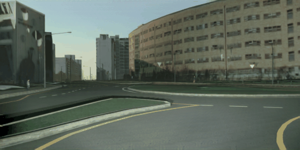

# MORAI SIM 데이터셋을 활용한 Image-to-Image Translation 연구
안녕하세요. AI 기술을 연구하며  MORAI SIM의 Virtual 데이터셋 개발을 담당하고 있는 임호준입니다.

본 포스팅에서는 자율주행 인지 모델 학습에 필요한 데이터셋을 구축하기 위하여  MORAI SIM의 데이터셋을 활용한 Image-to-Image Translation 연구를 수행한 내용을 전달드리고자 합니다.
<br>

---
### 🍀 용어 설명 
본문에서 언급되는 주요 기술 용어는 아래와 같습니다.

<pre>
  ◾ <b>Image-to-Image Translation(I2I)</b>: 가상 이미지를 현실 이미지로 변환하는 기술로 ‘SIM-to-Real’ 또는’Synthetic RGB-to Real-RGB’ Translation 라고도 부름

  ◾ <b>Source Domain</b>: I2I 연구에 사용한 원본 데이터만 존재하는 집합. 본 포스팅에 한해 Source Domain을 가상의 Synthetic 데이터가 존재하는 집합(데이터셋)으로 정의함. 
        예:  GTA5, SHIFT, Virtual KITTI Datasets

  ◾ <b>Source Image</b>: Source Domain에서 추출한 임의의 원본 이미지

  ◾ <b>Target Domain</b>:  I2I 연구에서 목표로 하는 타겟 데이터만 존재하는 집합. 본 포스팅에 한해 Target Domain을 현실의 Real 데이터가 존재하는 집합(데이터셋)으로 정의함.
        예: Cityscapes, nuScenes, BDD100K Datasets

  ◾ <b>Target Image</b>: Target Domain에서 추출한 임의의 타겟 이미지

  ◾ <b>Translated Image</b>: 특정 Source Image 를 Target Image로 변환하는 딥러닝 모델 <i>F</i>가 있다고 간주할 때, <i>F</i>에 의해 변환된 출력 이미지
  
  ◾<b>Domain</b>: 동일한 수준별로 분류한 특정 집합, 크게 가상 도메인과 현실 도메인이 있고, 각 도메인 내 해당 데이터가 속한 환경 요인에 따라  하위 도메인으로 분류할 수 있음
        예: 시간대에 따른 밤 도메인과 낮 도메인, 지리에 따른 도심 도메인, 시골 도메인

  ◾ <b>Domain Gap</b>: 동일한 수준에 의해 분류된 두개 혹은 그 이상의 서로 다른 집합에 속한 데이터 간의 차이
</pre>

## 들어가며
본론에 들어가기에 앞서, 본 포스팅의 주제인 Image-to-Image Translation (I2I)란 무엇이고, 기계 학습 분야 나아가서는 자율 주행의 인지 모델의 학습에는 어떻게 활용되는지 알아보겠습니다.

### Image-to-Image Translation(I2I) 이란

**Image-to-Image Translation(I2I)** 는 서로 다른 도메인에 속하는 이미지 간의 변환 기술입니다. <br>
**I2I** 는 Source Image의 내용(Content)은 유지하되 스타일(Style)을 바꾸는 연구에 주로 활용되므로 Style-Transfer(ST)라고도 불립니다.

아래 그림과 같이 Source Domain에 속하는 Source Image가 Target Domain에 속하는 Target Image처럼 보이도록 **I2I** 를 수행하면, 결과적으로 맨 우측의 Translated Image를 생성하게 됩니다.
{:onclick="window.open(this.src)" title="Click view screen" width="80%"}
<figcaption> 그림 1. I2I  원리를 설명한 예시 이미지 &nbsp; [출처: <a href="https://arxiv.org/pdf/2101.08629.pdf" target="_blank"> arxiv.org</a>] </figcaption>

I2I의 목표는 Source Image $I^{X}$가 주어졌을 때, Target Image $I^{Y}$와 유사한 Translated Image, 를 생성하는 것입니다. 이를 수식으로 표현하면 아래와 같습니다.

> $F(I^{X}) = I^{X \rightarrow Y } \approx I^{Y}$ 
>  
>  - $I^{X}$: I2I 모델의 입력으로 사용하는 임의의 Source Image(원본 이미지)
>  - $I^{Y}$: I2I 모델의 목표 대상으로 출력하는 임의의 Target Image(타겟 이미지)
>  - $X$: Source Domain
>  - $Y$: Target Domain
>  - $F$: I2I를 수행하는 딥러닝 모델, 입력 $I^{X}$를 가능한 $I^{Y}$로 출력하도록 변환하는 역할

### I2I의 목적 및 연구 분야
I2I 기술을 활용하는 목적은 넓게는 포토리얼즘의 향상시키는 것이며, 자율주행 도메인 분야로 한정한다면 AI 기계 학습에 필요한 데이터를 얻기 위해서입니다. <br>
따라서 본 포스팅에서 전달하는 I2I의 목적은 I2I 모델에서 얻은 데이터셋을 자율주행 인지 모델이 학습하여 인지 성능을 개선하는 것입니다.

I2I 모델 $F$에 있어서, Source Domain $X$ 와 Target Domain $Y$ 간에 데이터 알고리즘으로 나타내는 상관 관계가 존재한다면 I2I의 활용 범위는 매우 무궁무진합니다. <br>
아래 그림과 같이, Computer Vision과 Image Processing 분야에서는 다양한 애플리케이션에 I2I를 적용하고 있으며, 근래 들어 I2I 적용 사례가 기하급수적으로 늘어나고 있는 추세입니다.

{:onclick="window.open(this.src)" title="Click view screen" width="80%"}
<figcaption> 그림 2. I2I  적용 사례 &nbsp; [출처: <a href="https://arxiv.org/pdf/2101.08629.pdf" target="_blank"> arxiv.org</a>]</figcaption>

초창기 I2I 연구는 지도학습(Supervised Learning)에 기초를 두고 진행하는 경우가 많았습니다. <br>
지도학습은 기계학습 종류 중 하나로 정답이 있는 데이터를 학습하는 방식입니다. 

지도학습 기반의 I2I 연구를 하기 위해서는 Source Domain $X$와 Target Domain $Y$ 간에 1:1 관계성이 존재하는 Paired Datasets이 존재해야 합니다. 즉, 모델이 출력해야 하는 정답 데이터(Output Ground Truth)로써 Source Image에 대응하는 Target Image가 명확하게 정의되어야 합니다. 

 Paired Datasets을 공식으로 표현하면 아래와 같습니다.

> _Dataset_ = $\{ ( I^{X}_{i}, I^{Y}_{i}) \}_{i=1}^{N}$ 
>  
>  - $N$: Source Image 및 Target Image의 개수, 각 개수는 서로 동일함. 

지도학습 기반의 I2I는 i 번째에 해당하는 Source Image $I^{X}$와 Target Image $I^{Y}$가 항상 쌍으로 존재하는 Paired Datasets을 사용하므로, 이미지 간의 변환 정확도가 높은 편입니다. <br>
그러나 특정 도메인에 대해서만 유의미한 데이터를 구해야 하기 때문에 Paired Dataset의 구축 비용이 높을 뿐 아니라 타 도메인에 대한 활용성도 떨어집니다.

요즘에는 지도학습 기반의 Paired I2I 단점을 보완하고자 ‘비지도학습 기반의 I2I 연구’가 활발히 진행되고 있습니다. <Br>
비지도학습(Unsupervised Learning)은 지도학습과 반대로 답이 없는 데이터를 학습하는 방식으로, Source Image와 Target Image간의 1:1 관계성이 없는 Unpaired Datasets이 사용됩니다.

Unpaired Datasets을 공식으로 표현하면 아래와 같습니다.

> _Dataset_ = $\{ I^{X}_{i} \}_{i=1}^{N}, \{ I^{Y}_{i} \}_{i=1}^{M}$
>  
> - $N$: Source Image 개수
> - $M$: Target Image 개수
> 
>    ※ $N$과 $M$은 서로 다름, 즉 $I^{X}$와  $I^{Y}$가 쌍으로 존재하지 않음 

비지도학습 기반의 I2I는 Source Image에 대응되는 Target Image가 Output GT 로 정의되지 않더라도 딥러닝 모델의 성능을 보장합니다. 이는 특정 도메인에 대한 제약 없이 데이터셋 구축이 용이할 뿐만 아니라, I2I 모델을 다른 도메인에도 활용할 수 있다는 장점을 가져옵니다.

따라서 비지도학습 기반의 I2I는 데이터셋 구축의 용이성과 I2I 기술의 활용성 면에서 장점을 가지기 때문에, 이에 대한 연구를 MORAI SIM을 활용하여 수행해보고자 했습니다.

## 연구 배경
모라이에서는 자체 개발한 시뮬레이터 플랫폼인 MORAI SIM을 통해 현실에 가까운 다양한 도메인의 데이터셋을 구축하고 있습니다. 

I2I  연구 분야는 매우 다양하지만 본 포스팅에서는 비지도 학습 기반의 SIM to Real Image Translation을 연구 과제로 설정한 이유는 아래와 같은 MORAI SIM의 장점을 연구에 활용해볼 수 있기 때문입니다.

 - Edge & Rare case 구현 
 - 커스텀 데이터 생성에 용이

Edge/Rare case는 악천후와 같은 극악한 상황 또는 자주 발생하지 않으나 예측하지 못한 사고를 말합니다. <br>
자율주행 인지 모델은 Edge & Rare case를 많이 학습해야 실제 그러한 상황이 발생했을 때 인지 성능을 발휘할 수 있습니다. 그러나 현실적으로 이러한 Edge/Rare 상황들만 모아 대량의 데이터셋으로 구축하기란 매우 어렵습니다.

### 계기: MORAI SIM의 장점 활용
MORAI SIM 환경에서는 현실(Real)에서 취득하기 어려운 Edge & Rare case를 용이하게 구현할 수 있습니다. 이는 3D 물리 엔진을 기반으로 개발된 시뮬레이터의 도구적 특성이기도 합니다.<br>
아래 그림과 같이 MORAI SIM에서 취득한 데이터는 악천후의 날씨(좌그림)와 갑자기 사람이 도로에 출현하는 상황(우그림)을 그대로 모사하고 있어 Edge & Rare case에 취약한 인지 모델의 단점을 보완할 수 있습니다.

{:onclick="window.open(this.src)" title="Click view screen" width="90%"}
<figcaption>그림 3. MORAI SIM에서 Edge/Rare case를 구현 및 추출한 RGB 이미지</figcaption>

Edge & Rare case 구현에 용이한 SIM의 특성은 ‘왜 I2I 에 시뮬레이터 데이터를 사용하는가’에 대한 답이자, SIM to Real Image Translation 연구를 하게 된 충분한 동기입니다.

두번째로, MORAI SIM은 사용자가 얻고자 하는 방향으로 다양한 형태의 데이터를 가공 및 생성할 수 있습니다. <Br>
MORAI SIM의 센서 모듈은 센서의 위치, 각도 뿐만 아니라 다양한 형태의 정답 데이터를 지원하며, 시나리오 모듈은 현실에 존재하는 다양한 동적/정적 객체 모델을 제공합니다. <Br> 이러한 MORAI SIM의 특성을 활용하면 뒤에서 설명할 ‘Semantic domain gap’을 수월하게 해결해볼 수 있습니다.

### 해결 과제: Domain gap

Domain gap은 서로 다른 두개 혹은 그 이상의 도메인 간에 존재하는 환경적, 외형적인 차이입니다. <Br>
예를 들어, ‘도심’이라는 도메인에서 수집한 데이터는 ‘시골’이라는 도메인에서 수집한 데이터와 비교했을 때 건물의 양상, 도로 표면 등에서 차이를 보일 것입니다. <br>
또 다른 예로, 동일한 장소더라도 ‘낮’이라는 도메인에서 수집한 데이터는 ‘밤’이라는 도메인에서 수집한 데이터와는 조명, 빛, 색 등의 차이를 보이게 됩니다.
Domain gap은 도메인을 구성하는 환경, 조명, 다양한 객체들의 외형, 각 객체를 인지하는 카메라의 위치 및 각도 등과 같이 다양한 변수의 조합으로 발생합니다.

본 포스팅에서는 크게 아래의 두 가지를 Domain gap을 발생시키는 요소로 정의하겠습니다.

- **RGB Domain gap**: RGB 이미지 데이터가 속한 가상과 현실 도메인 간의 차이. 각 도메인에서 동일한 객체 및 환경을 RGB 이미지를 추출했을 때 건물, 도로의 텍스처 또는 질감과 같이 육안으로 명확히 구분할 수 있는 외형적인 차이에서 발생.

- **Semantic Domain gap**: Semantic 이미지 데이터가 속한 가상과 현실 도메인 간의 차이. 각 도메인에서 동일한 객체 및 주변 환경을 Sematic 이미지로 나타내었을 해당 객체들의 종류와 카메라에 투영되는 위치의 차이에서 발생.

{:onclick="window.open(this.src)" title="Click view screen" width="90%"}
<figcaption>그림 4. RGB  Domain gap(좌)과 Semantic Domain gap(우) 예시 &nbsp; [출처: <a href="https://arxiv.org/pdf/2101.08629.pdf" target="_blank"> arxiv.org</a>]</figcaption>

위 그림에서 동일한 객체에 대해 현실 데이터셋(BDD, KITTI, Cityscapes)과 가상 데이터셋(Virtual KITTI 1/2,GTA5, SHIFT, MORAI)을 비교해보면 RRG Domain gap보다는 Semantic Domain gap의 차이가 적다는 것을 육안으로도 바로 확인할 수 있습니다.

이는 가상의 그래픽 텍스처에서 주는 느낌이 현실과는 확연히 다름을 보이는 RGB domain gap에 비하여 Semantic domain gap이 보다 수월하게 해결될 수 있다는 의미를 전합니다.

### 방안: I2I 적용하여 Domain gap 완화
자율주행 모델이 가상 도메인의 시뮬레이터에서 취득한 데이터로만 학습하면 인지 성능이 오히려 감소하거나 크기 오르지 않는 현상이 종종 발생합니다. 딥러닝 분야의 [많은 연구자들](https://machinelearning.apple.com/research/bridging-the-domain-gap-for-neural-models)은 이러한 현상의 원인이 Domain gap에 있다고 얘기합니다.

아래 그림과 같이 시뮬레이터에서 취득한 데이터셋과 현실 도메인에서 취득한 데이터셋 간의 차이는 Domain gap을 포함하고 있습니다. 이는 인지 모델이 학습해야 하는 영역이 증가한다는 것을 의미하며 인지 성능에 악영향을 주게 됩니다. <br>
 쉽게 말해, 인지 모델이 언어 영역의 문제들(현실 데이터셋)로만 학습하고 시험을 봐야 하는데 언어 영역 뿐만 아니라 수학, 과학 등 시험과는 상관없는 영역들의 문제들(가상 데이터셋)까지 학습하여 시험을 못보게 되는 결과로 비유할 수 있습니다.

{:onclick="window.open(this.src)" title="Click view screen" width="80%"}
<figcaption>그림 5. 현실 데이터셋(파란색)과 가상의 MORAI SIM 데이터셋(빨간색) 간의 차이</figcaption>


그런데 이러한 결과를 놀고 볼때, 아래 그림과 같이 Domain gap이 줄어들도록 변환된 MORAI SIM 데이터셋(Translated MORAI)을 생성한다면  가상의 데이터만으로도 모델의 성능 향상에 기여할 것이라고 예측해볼 수 있습니다.

{:onclick="window.open(this.src)" title="Click view screen" width="80%"}
<figcaption>그림 6. 현실 데이터셋(파란색)과 변환 데이터셋(분홍색) 간의 차이</figcaption>

따라서 I2I를 적용하여 현실 도메인에 가까운 변환 데이터셋(Translated MORAI Dataset)을 구축하는 것이 'Domain gap'을 완화하기 위한 방안이 되겠습니다.

## 연구 방법
I2I 기술을 적용하기 위해 MUNIT, INIT, DUNIT, DRIT(논문 링크 첨부 예정)와 같이 I2I 모델을 연구한 여러 논문을 조사해보았고, 여기서 제시한 I2I 모델을 분석하고 재현해보았습니다. 
이어서, I2I 모델를 적용한 MORAI SIM 데이터셋을 학습한 결과와 현실 데이터셋을 학습한 결과를 비교함으로써, MORAI SIM을 활용한 비지도 학습 기반의 I2I가 '인지 성능 개선'에 기여하는가에 대해 본 연구의 타당성을 고찰해볼 수 있었습니다.

### 가정 사항
연구를 진행하기에 앞서 Image가 아래의 Content와 Style의 조합으로 구성되어있다는 가정을 사용했습니다.

- Content: 의미를 가진 모든 객체(Object shape)
- Style: 객체를 둘러싼 배경의 질감, 사실감, 조명 및 조도(Texture, Illumination, Light, etc.)

이와 같은 가정은 앞에서 조사한 I2I 연구 논문에서도 사용하고 있습니다. 

가정에 따른 I2I 모델 $I^{X}$은 아래와 같은 이미지 디코딩 알고리즘 방식으로 Source Image의 'Content'와 Target Image의 'Style'를 결합하여 Translated Image를 생성합니다.

{:onclick="window.open(this.src)" title="Click view screen" width="80%"}
<figcaption> 그림 7. I2I 모델의 이미지 디코딩 알고리즘 &nbsp; [출처: 
  <a href="https://arxiv.org/pdf/2101.08629.pdf" target="_blank"> arxiv.org</a>] 
</figcaption>

>
 $F(I^{X}) = I^{X}_{content} + I^{Y}_{style}$

### VSA 방식의 I2I 모델 적용
두번째로, 
[Vector Symbolic Architecture Image Translation(VSAIT)](https://www.ecva.net/papers/eccv_2022/papers_ECCV/papers/136810017.pdf) 연구 논문에서 제안한 Vector Symbolic Architecture(VSA) 방식의 I2I 모델을 재현해보고 이를 MORAI SIM 데이터셋에 적용해보았습니다.

VSA는 vector space에서 정의한 algebraic operation을 통해 Source Image의 Src. Content와 Target Image의 Trg. Style과 결합하하여 Translation Image를 생성하는 방식입니다. 이를 공식으로 표현하면 아래와 같습니다.

>
  - Src = Src.Content + Src.Style
  - Translated Src = Src.Content + Trg.Style
  - `+` : Binding operator

{:onclick="window.open(this.src)" title="Click view screen" }
<figcaption>그림 8. VSA 방식을 적용한 I2I 모델의 Translation 이미지 예시</figcaption>

그리고 논문에서 제안한 VSA-based constraints on adversarial learning 방식으로, Src.Content는 유지한 채 Src-to-Trg translation이 가능한 Vector mapping function, $F$를 구할 수 있었습니다.

※ $F$는 Trg-to-Src translation도 가능

[VSA 방식의 I2I 모델](https://github.com/facebookresearch/vsait)를 재현한 결과,
현실의 타겟 데이터셋(예:Cityscapes)을 목표로 가상 데이터셋(예: GTA) 이미지에 대한 변환 이미지는 아래와 같습니다.

{:onclick="window.open(this.src)" title="Click view screen"}
<figcaption>그림 9. VSA 방식의 I2I 모델로 생성한 변환 이미지 예시</figcaption>

마지막으로 MORAI SIM 데이터셋에도 동일한 I2I 모델을 적용하여 아래와 같은 Translated MORAI Dataset을 구축해보았습니다.

{:onclick="window.open(this.src)" title="Click view screen"}
<figcaption>그림 10. VSA 방식의 I2I 모델을 적용한 Translated MORAI Dataset 예시</figcaption>

## 연구 결과
**{본론4}**
{:onclick="window.open(this.src)" title="Click view screen" width="80%"}
<figcaption><b><center> TODO: table을 새로 만들어서 값을 채워넣는게 좀더 깔끔할듯, 무슨 network 사용했는지 명시 </center></b></figcaption>


| Train       | Val | person | car | truck | bus | mAP* (%) |
| :---------: | :----------------------------------: | :--: |:--: |:--: |:--: |:--: |
| `Cityscapes` | :material-check-all: Cityscapes | 40.7 | 57.9 | 34.5 | 55.8 | 47.2 |
| `MORAI + Cityscapes` | :material-check-all: Cityscapes | 40.7 | 57.9 | 34.5 | 55.8 | 47.2 |
| `Cityscapes` | :material-check-all: Cityscapes | **40.7** | **57.9** | **34.5** | **55.8** | **47.2** |


 <table>
      <thead>
        <tr>
          <th style="border-left: none; background-color: #c9dff379; padding: auto 5rem; text-align: center;">Train</th>
          <th style="border-left: none; background-color: #c9dff379; padding: auto 5rem; text-align: center;">Val</th>
          <th style="text-align: center; background-color: #f7f5f5;">person</th>
          <th style="text-align: center; background-color: #f7f5f5;">car</th>
          <th style="text-align: center; background-color: #f7f5f5;">truck</th>
          <th style="text-align: center; background-color: #f7f5f5;">bus</th>
          <th style="text-align: center; background-color: #fbe9e7;">mAP* (%)</th>
        </tr>
      </thead>
      <tbody>
        <tr>
          <td style="text-align: center;">Cityscapes</td>
          <td style="text-align: center;">Cityscapes</td>
          <td style="text-align: center;">40.7</td>
          <td style="text-align: center;">57.9.7</td>
          <td style="text-align: center;">34.5</td>
          <td style="text-align: center;">55.8</td>
          <td style="text-align: center;">47.2</td>
        </tr>
        <tr>
          <td style="text-align: center;">MORAI + Cityscapes</td>
          <td style="text-align: center;">Cityscapes</td>
          <td style="text-align: center;">40.7</td>
          <td style="text-align: center;">57.9.7</td>
          <td style="text-align: center;">34.5</td>
          <td style="text-align: center;">55.8</td>
          <td style="text-align: center;">47.2</td>
        </tr>
        <tr>
          <td style="text-align: center;">Cityscapes</td>
          <td style="text-align: center;">Cityscapes</td>
          <td style="text-align: center; font-weight: bold;">40.7</td>
          <td style="text-align: center;">57.9.7</td>
          <td style="text-align: center;">34.5</td>
          <td style="text-align: center;">55.8</td>
          <td style="text-align: center;">47.2</td>
        </tr>
      </tbody>
 </table>

{:onclick="window.open(this.src)" title="Click view screen" width="90%"}
<figcaption><b><center> TODO: table을 새로 만들어서 값을 채워넣는게 좀더 깔끔할듯, 무슨 network 사용했는지 명시 </center></b></figcaption>

<div class="grid cards" markdown>

- {:onclick="window.open(this.src)" title="Click view screen"}
- {:onclick="window.open(this.src)" title="Click view screen"}

</div>
<figcaption><b><center>TODO: caption</center></b></figcaption>

연구 결과로 무엇을 증명할 수 있었고 어떻게 활용해볼수 있을까요?
 
- 장점
    - 실험결과 성능은 일단 오름
    - unpaired이기에 GT가 필요하지 않음.
    - 따라서, domain gap이 완화되었을 때, 시뮬레이터 데이터가 인지성능 개선에 유의미하게 도움이 될 수 있음을 확인하였음.
- 단점 
    - semantic flipping
    - 인지관점에서 주요 정보들에 대한 손실 (표지판, 신호등)
  
{:onclick="window.open(this.src)" title="Click view screen" width="80%"}
<figcaption><b><center> TODO: caption </center></b></figcaption>
<br>
{:onclick="window.open(this.src)" title="Click view screen" width="80%"}
<figcaption>TODO: 표지판 아래 빨간선을 빨간 box로 대체</figcaption>

## 마치며
**{결론}**

결론에서는 본론 초반에서 제기한 문제를 다시 한번 상기시키며 이를 해결하기 위한 연구 방법, 결과를 요약하고 강조합니다. 끝으로 독자에게 간단한 조언을 남기며 마무리합니다.

* 본 연구를 하게 된 계기는 MORAI data와 Real data 사이에 존재하는 domain gap을 완화할 방법이 필요하다는 것이였고, 이를 Image-to-Image Translation(I2I) 연구를 통해 해결해볼 수 있었습니다. 
* 다만, 상기 실험에서 확인한 것과 같이 아직 해결해야 하는 부분이 있습니다.
    * Semanitc flipping, fine-detail 
* 향후에는 semantic label, bounding-box label등을 활용하여 상기 언급한 단점을 보완하는 방향으로 연구를 진행할 계획입니다.
* 저희와 같이 인지 학습 데이터를 연구하시는 분들께 본 포스팅에서 다룬 Image-to-Image Translation 연구 방법 및 결과가 도움되시길 바라며 이만 마치도록 하겠습니다. 
* 감사합니다.


---
Then, open up `hello-world.md`, and add the following lines:

``` { .sh .no-copy }
.
├─ docs/
│  ├─ posts/
│  │  └─ hello-world.md # (1)!
│  └─ index.md
└─ mkdocs.yml

```

1.  If you'd like to arrange posts differently, you're free to do so. The URLs
    are built from the format specified in [`post_url_format`][post slugs] and
    the titles and dates of posts, no matter how they are organized
    inside the `posts` directory 

---