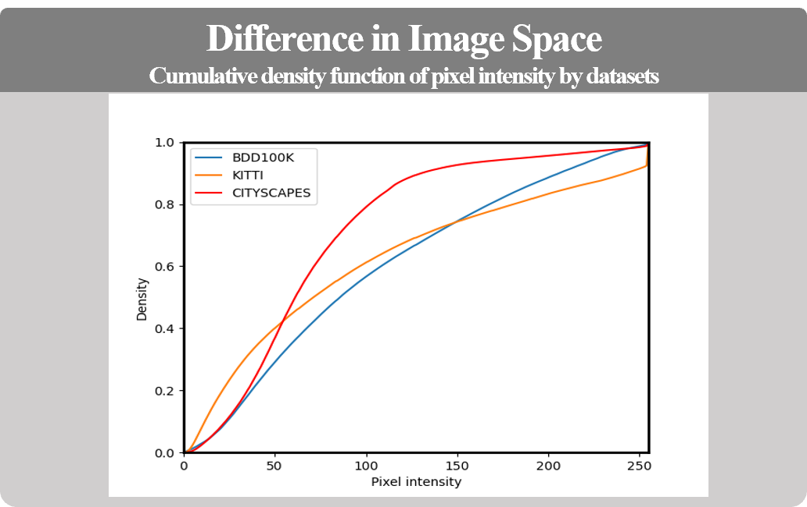
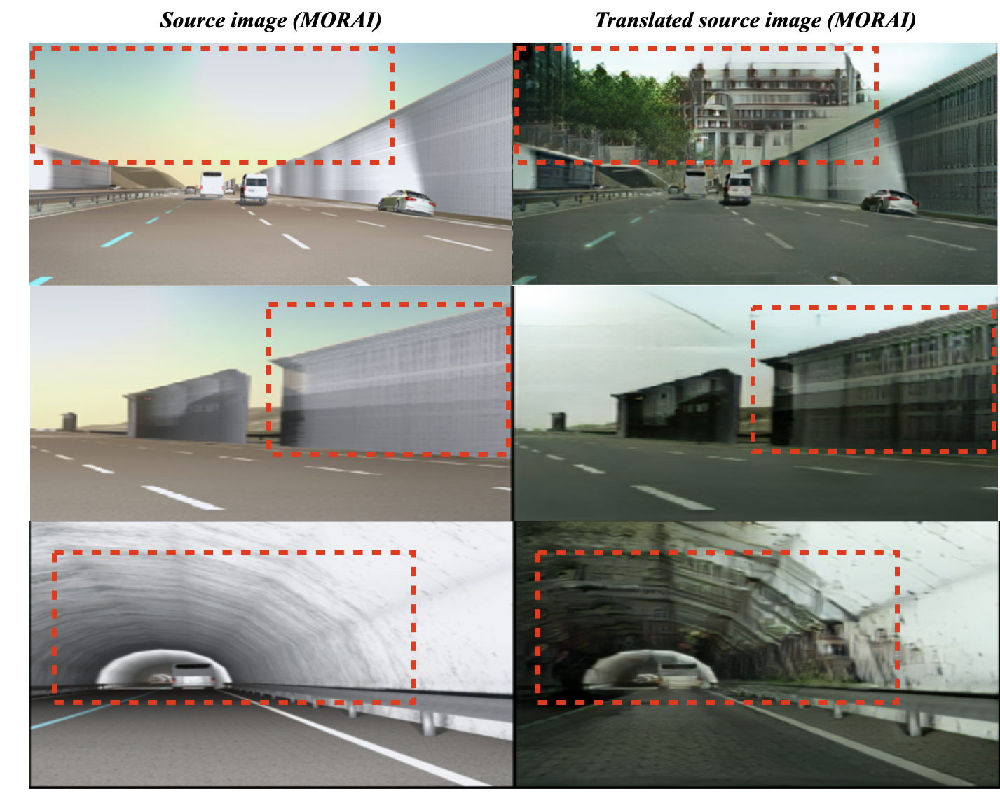

# Image-to-Image Translation 연구의 장단점
**{요약부}**

안녕하세요. Morai SIM에서 DataGen을 활용한 Virtual Dataset 구축 및 AI 기술을 활용한 연구개발을 담당하고 있는 임호준입니다.

본 포스팅에서는 인지 학습 데이터셋 구축에 있어 Image-to-Image Translation(Synthetic-RGB to Real-RGB) 기술의 필요성 및 장단점을 알아보며 이를 MORAI Dataset에 수행한 결과를 공유드리고자 합니다.

## 들어가며
**{서론부}**

Image-to-Image(I2I) Translation 또는 Style-transfer(ST)라고도 불리는 연구는 MORAI Dataset 중 Camera RGB image를 Real image와 유사하게 보이도록 Photorealism을 향상시키고자 시작하게 되었습니다.

I2I란 무엇이고, 인지 학습 데이터셋에 어떻게 활용되며 활용했을 때의 장점은 무엇인지 알아보겠습니다. 

>  🍀**주요 용어 설명** 
>
>  - **Image-to-Image(I2I) Translation**: Source domain $X$에 속하는 이미지를 Target domain $Y$에 속하는 image처럼 보이도록, image 내 content는 유지하되 style을 바꾸는 task.  
  즉, I2I는 하나의 딥러닝 모델 $F$이며, Source domain $X$에서 임의의 image $I^{X}$가 주어졌을 때, Target domain $Y$의 image $I^{Y}$를 모사하는 역할을 합니다, $I^{Y} \approx F(I^{X})$.
  - **Source Domain**: 임의의 Synthetic Dataset (GTA5, SHIFT, Virtual KITTI, MORAI, etc.)
  - **Source Image**: Source domain에서 추출된 임의의 한 image
  - **Target Domain**: 임의의 Real Dataset (Cityscapes, nuScenes, BDD100K, etc.)
  - **Target Image**: Target domain에서 추출된 임의의 한 image
>  - **Translated Image**: 딥러닝 모델 $F$가 Source image 한장을 input으로 하여 생성한 output, $F(I^{X})$ (Target과 유사하도록 생성하는 것이 목표).

### Image-to-Image (I2I) Translation 이란

* 앞선 언급과 같이 I2I의 목표는, Source Image $I^{X}$가 주어졌을 때, Target Image $I^{Y}$와 유사하도록 Translated Image $F(I^{X})$를 생성하는 것이 목표.

{:onclick="window.open(this.src)" title="Click view screen" width="60%"}

 
  
<b>그림 1. I2I 예시 </b> [출처: 
  <a href="https://arxiv.org/pdf/2101.08629.pdf" target="_blank"> arxiv.org
  </a>]
  
 

 
### I2I 활용 분야
* Source domain $X$와 Target domain $Y$ 사이에 data로 표현가능한 인과관계만 존재한다면, I2I를 적용할 수 있기에 활용 범위가 무궁무진한 기술 중 하나입니다.
* 예시로, 하기 그림에서와 같이 computer vision과 image processing 분야에서는 이미 다양한 application에 적용중에 있으며 그 수가 지난 몇년간 기하급수적으로 늘고있습니다. 

{:onclick="window.open(this.src)" title="Click view screen" width="60%"}
<figcaption><b>
그림 1. Image decoding 예시, [출처: 
  <a href="https://arxiv.org/pdf/2101.08629.pdf" target="_blank"> arxiv.org
  </a>] 
</b></figcaption>
* 또한, 지도학습(Supervised learning)의 경우 Source domain $X$와 Target domain $Y$ 사이에 1:1 관계(paired)로 표현되는 (input, output GT)가 정의되어야 하기에 Dataset 구축 비용이 큰 편이나, 요즘에는 input에 대응하는 output GT가 없더라도 동작하는 비지도학습 기반의 unpaired I2I가 활발히 연구되고 있습니다.

## I2I 연구 배경
**{본론1}**

* 시뮬레이션 데이터는 현실에서는 수집하기 어려운 edge/rare case가 모사된 데이터를 쉽게 생성할 수 있음

{:onclick="window.open(this.src)" title="Click view screen" width="90%"}
<figcaption><b>
 Sample image: goal of this RnD 
</b></figcaption>

* 이러한 데이터를 활용함으로서 기존 인지 모델이 취약한 edge/rare case에 대해 보완해줄 수 있음.
* 문제는 domain gap에 있음.

>  🍀**Domain Gap** 
>
>  - Domain gap 정의 서술
  
* domain gap을 발생시키는 원인은 복합적이지만, 본 문서에서는 크게 두 가지로 정의한다.
    * Semantic domain gap: 카메라 설치 위치, 주행 중 등장하는 객체들의 종류와 위치의 차이 (Spatial prior 참고)
    * Image domain gap: 수집된 장소, 나라에 따라 domain gap이 발생함.
* Semantic domain gap은 시뮬레이터의 장점을 활용해 상대적으로 수월하게 해결이 가능
* Image domain gap은 그렇지 못함
    * Game/graphic texture의 느낌이 현실에 존재하는 object들의 표면과는 상이하기 때문.
    * BDD100K, KITTI, Cityscapes는 현실(Real), 그외는 가상 (Sim/Synthetic)
    * 현실과 가상 이미지가 주어졌을 때 사람이 그것을 쉽게 구별할 수 있음 (domain gap).

{:onclick="window.open(this.src)" title="Click view screen" width="100%"}
<figcaption><b>
 Sample image: goal of this RnD 
</b></figcaption>

{:onclick="window.open(this.src)" title="Click view screen" width="60%"}
<figcaption><b>
 Sample image: goal of this RnD 
</b></figcaption>

* 이러한 차이가 모델이 시뮬레이션 데이터를 활용해 성능을 향상시키는데 방해하는 역할을 함.
  * 모델이 학습해야하는 영역이 오히려 크게 늘어나기 때문 (domain gap 포함)
  * MORAI Dataset을 단순 학습하였을 때는 Synthetic domain과 Real domain 사이의 Gap으로 인해 인지 성능이 잘 나오지 않음.

{:onclick="window.open(this.src)" title="Click view screen" width="60%"}
<figcaption><b>
 Sample image: goal of this RnD 
</b></figcaption>

* 바꿔 말하면, 이러한 domain gap을 줄여준다면, 시뮬레이션 데이터가 온전히 모델의 성능향상에 기여할 수 있도록 도움을 줄 수 있음.
    * domain gap 감소

{:onclick="window.open(this.src)" title="Click view screen" width="60%"}
<figcaption><b>
 Sample image: goal of this RnD 
</b></figcaption>

* 따라서, domain gap을 줄일 수 있는 기술인 I2I (Simulator-to-Real)을 적용하고자 한다.
  * I2I를 통해 domain gap이 줄어든 translated MORAI Dataset을 구축하고, 인지성능을 개선하는 것이 목표

## 연구 방안 및 계획
**{본론2}**
연구를 하기 위해 준비했던 일들을 설명해주세요.

실제로 연구를 진행한 단계 별 방법을 절차대로 작성해주세요.

* 이 목표를 달성하기 위해, I2I를 연구하는 많은 연구자는 Image가 Content와 Style의 조합으로 구성되어있다는 직관적인 가정을 사용한다.
    * MUNIT, INIT, DUNIT, DRIT, etc.
    * Content: object shape, Style: Texture, Illumination, Light, etc.
* 즉, Source Image의 Content를 Target Image의 Style과 결합하여 Translated Image를 생성한다.
    * $F(I^{X}) = I^{X}_{content} + I^{Y}_{style}$
 
{:onclick="window.open(this.src)" title="Click view screen" width="70%"}
<figcaption><b>
그림 1. Image decoding 예시, [출처: 
  <a href="https://arxiv.org/abs/1804.04732.pdf" target="_blank"> arxiv.org
  </a>] 
</b></figcaption>

* [VSAIT](https://morai.atlassian.net/wiki/spaces/MTG/pages/1429602423/VSAIT+Unpaired+Image+Translation+via+Vector+Symbolic+Architectures) 내용 옮겨적기

{:onclick="window.open(this.src)" title="Click view screen" width="90%"}
<figcaption><b>
 VSAIT 출처 넣기 
</b></figcaption>

## 연구 진행 순서 및 방법
**{본론3}**

* 우선 Domain gap을 핸들링 하지 않았을 때의 MORAI Data가 인지 성능에 어떠한 영향을 끼치는지 확인하였음.
    * Score가 나아지는지 혹은 아닌지
* 성능 하락 혹은 유의미한 성능 향상이 관측되지 않았을 경우, 이를 보완하기 위한 방법에 대한 고민
* 상기 그림의 image samples/spatial prior 분석결과 Domain gap이 원인일 것이라 판단하여 이를 줄이기 위한 I2I 기법들에 대한 연구개발 수행
    * VSAIT, SRUNIT, DRIT 등의 다양한 논문들이 I2I에 대해 수행하고 있음.

* 따라서 해당 논문들의 실험을 재현하고,
{:onclick="window.open(this.src)" title="Click view screen"}
<figcaption><b>
 test 
</b></figcaption>

* 그 뒤 MORAI Dataset에 맞도록 가공
{:onclick="window.open(this.src)" title="Click view screen"}
<figcaption><b>
 tes 
</b></figcaption>

## 연구 결과
**{본론4}**
{:onclick="window.open(this.src)" title="Click view screen" width="80%"}
<figcaption><b>
 table을 새로 만들어서 값을 채워넣는게 좀더 깔끔할듯, 무슨 network 사용했는지 명시 
</b></figcaption>

{:onclick="window.open(this.src)" title="Click view screen" width="90%"}
<figcaption><b>
 table을 새로 만들어서 값을 채워넣는게 좀더 깔끔할듯, 무슨 network 사용했는지 명시 
</b></figcaption>

-   

    

    - {:onclick="window.open(this.src)" title="Click view screen"}
      <figcaption><b>
그림 1. MORAI SIM 샘플 데이터
</b></figcaption>
    - {:onclick="window.open(this.src)" title="Click view screen"}
      <figcaption><b>
그림 2. MORAI SIM 샘플 데이터
</b></figcaption>

    

연구 결과로 무엇을 증명할 수 있었고 어떻게 활용해볼수 있을까요?
 
- 장점
    - 실험결과 성능은 일단 오름
    - unpaired이기에 GT가 필요하지 않음.
    - 따라서, domain gap이 완화되었을 때, 시뮬레이터 데이터가 인지성능 개선에 유의미하게 도움이 될 수 있음을 확인하였음.
- 단점 
    - semantic flipping
    - 인지관점에서 주요 정보들에 대한 손실 (표지판, 신호등)
  
{:onclick="window.open(this.src)" title="Click view screen" width="80%"}
<figcaption><b>
 table을 새로 만들어서 값을 채워넣는게 좀더 깔끔할듯 
</b></figcaption>

{:onclick="window.open(this.src)" title="Click view screen" width="80%"}
<figcaption><b>
 표지판 아래 빨간선을 빨간 box로 대체 
</b></figcaption>

## 마치며
**{결론}**

결론에서는 본론 초반에서 제기한 문제를 다시 한번 상기시키며 이를 해결하기 위한 연구 방법, 결과를 요약하고 강조합니다. 끝으로 독자에게 간단한 조언을 남기며 마무리합니다.

본 연구를 하게 된 계기는 ~가 필요하단 거였고 Label-to-Image Translation 연구를 통해 해결해볼 수 있었습니다. 

Label-to-Image Translation은 기본적으로 ill-posed problem이기에, 아직 연구할 부분이 많습니다. 그러나 Static object 및 Scene에 대한 합성 qaulity는 높기에 Label-to-Image와 Image-to-Image translation을 융합하는 방식으로 고도화가 가능할 것이라고 기대합니다.

저희와 같이 인지 학습 데이터를 연구하시는 분들께 본 포스팅에서 다룬 Image-to-Image Translation 연구 방법 및 결과가 도움되시길 바라며 이만 마치도록 하겠습니다. 감사합니다.

