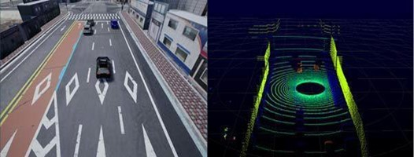
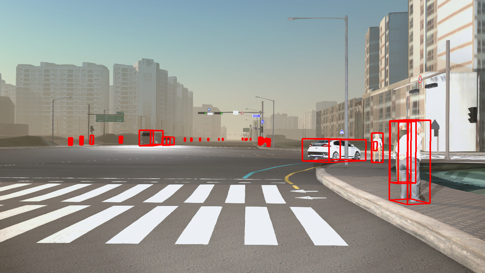
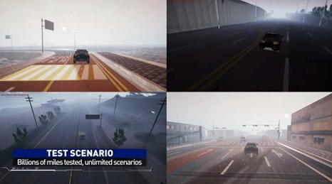
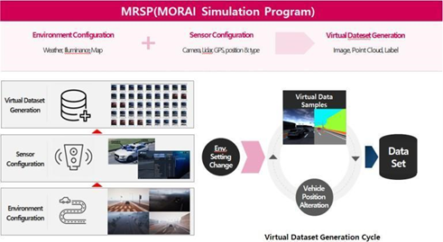
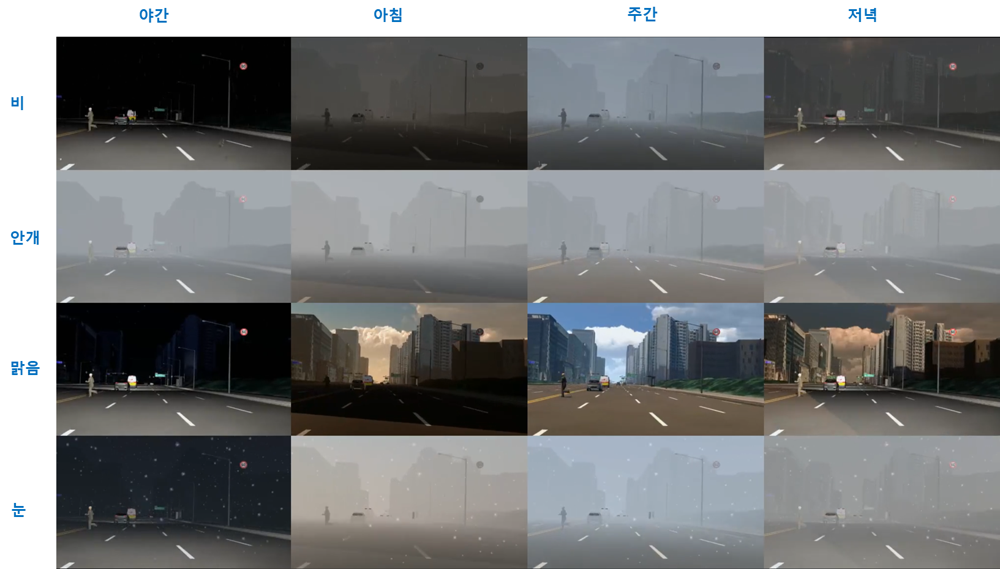

# MORAI SIM의 학습 데이터셋 생성 기술
자율주행 기술의 완성도를 높이기 위한 핵심은 ‘정확한 인지’를 기반으로 한 정확한 판단과 제어입니다. 

최근 자율주행의 인지 기술로 딥러닝 기반의 객체 인식 기술, 특정 사물을 파악하는 원리를 스스로 파악하는 머신 러닝 기술이 각광받는 가운데, 
인지 성능의 개선을 위한 양질의 학습 데이터가 필수적으로 요구되고 있습니다.

본 글에서는 국내 자율 주행 개발 환경에 맞추어, 양질의 학습 데이터셋을 구축할 수 있는 MORAI SIM의 데이터셋 생성 기술을 살펴보겠습니다.

## 들어가며
자율주행 분야에서 당면하고 있는 과제는 보다 정확하게 객체를 인식하기 위한 ‘인지 성능 향상’입니다. 자율주행에 머신러닝 기술을 적용한다면 자율주행 차량의 센서로 주변 환경 및 특정 사물을 파악하는 원리를 스스로 학습할 수 있습니다.

최근 머신러닝 기술 발전으로 자율주행의 인지 크게 향상되었지만, 인지율 향상은 머신러닝 또는 딥러닝 알고리즘의 적용만으로 이뤄낼 수 없습니다. 
머신러닝의 핵심은 데이터이기 때문에, 자율주행의 인지 성능 향상을 위해서는 양질의 학습 데이터셋 구축이 필수로 요구됩니다.

MORAI SIM은 가상의 주행 환경에서 자율주행 테스트를 할 수 있는 시뮬레이션 플랫폼으로, 실제 자율 주행 개발에 필요한 학습 데이터셋을 자동으로 생성할 수 있습니다. 

## MORAI SIM의 데이터셋 생성 기술 특징
MORAI SIM의 학습 데이터셋 생성 기술은 자율주행 인지 모델에 적용할 수 있는 데이터셋의 일반성, 실사성, 정확성의 조건을 모두 만족한다고 볼 수 있습니다.

### 정답 데이터 자동 생성
MORAI SIM은 가상의 센서 모델를 활용하여 실제 주행 환경과 정답 데이터를 자동으로 생성합니다. 즉, 센서에서 검출한 객체는 무엇이고 어디에 위치하는지 라벨 정보를 달아준다고 생각하면 쉽습니다.

정답 데이터는 말 그대로 답이 있는 데이터로, 머신러닝의 지도 학습에 사용됩니다. 따라서 정답 데이터는 학습 데이터에 포함하며, 자율주행 인지 모델이 학습하는데 있어 중요한 부분을 차지합니다.  
아직까지는 머신러닝을 위한 데이터셋 구축 기술이 많이 보급화되지 않았기 때문에 이러한 정답 데이터를 모으기 위해 사람이 Raw 데이터를 관측하여 직접 라벨링을 하는 경우가 많습니다. 

MORAI SIM에서는 센서에서 검출한 데이터에 대한 라벨링를 자동화할 수 있어 정답 데이터로 가공하는 데에 드는 비용과 시간을 대폭 줄일 수 있습니다.
특히, MORAI SIM은 라이다 센서 모델에서 검출한 객체인 차량, 도로, 건물 등이 각 어떤 클래스에 속해 있는지를 점군 형태로 나타냅니다. 정답 데이터를 점군 형태로 나타내는 것은 이미지보다 어렵기 때문에, MORAI SIM의 라이다 센서를 활용한 정답 데이터 생성은 매우 큰 장점이라 할 수 있습니다.

<figcaption><b>
그림 1. MORAI SIM 라이다 센서로 검출한 점군 형태의 정답 데이터
</b></figcaption>

카메라 센서의 정답 데이터의 경우, 이미지 분할 방식인 Semantic Segmentation을 적용하여 검출 객체를 클래스 단위로 분류하고 자체 태깅 룰에 맞는 특정 색상으로 나타냅니다. 또한 객체 별 색상에 매핑된 픽셀값을 2D 및 3D Bounding Box(BBox) 데이터로 변환하여 이미지 상에 표현할 수 있습니다

BBOX는 정답 데이터 중의 하나로, MORAI SIM은 객체 이미지 상의 2D 및 3D BBOX 표시와 함께 아래와 같은 텍스트 형태의 좌표 정보를 생성합니다.

 - 2D BBOX: 객체를 둘러싼 좌상단, 우하단에 대한 x, y 값
 - 3D BBOX: 객체를 둘러싼 3차원 박스의 각 꼭지점 x, y, z 값

{:onclick="window.open(this.src)" title="Click view screen" width="80%"}
<figcaption>그림 2. MORAI SIM 카메라 센서에서 검출한 Semantic Segmentation 이미지</figcaption>

{:onclick="window.open(this.src)" title="Click view screen" width="80%"}
<figcaption>그림 3. MORAI SIM 카메라 센서에서 검출한 RGB 이미지 및 3D BBox</figcaption>

MORAI SIM의 센서 모델에서는 개선된 이미지 분할 방식인 ‘Mesh Segmentation'과 Labeling’을 모두 지원하므로 객체의 Global 좌표 값을 활용하여 정답 데이터를 보다 정확하게 생성할 수 있습니다.

### 다양한 주행 환경을 반영한 학습 데이터셋 생성 
MORAI SIM은 실제의 다양한 주행 환경을 재현하여 인지 모델의 일반성과 신뢰성을 보장하는 학습 데이터셋을 생성합니다.

MORAI SIM에서 제공하는 맵과 차량 모델은 실제 존재하는 도로, 교통 표지판, 특수 차량 등을 그대로 모사했기 때문에, 이를 바탕으로 국내 교통 환경에 최적화된 데이터를 생성할 수 있습니다. 
특히 비, 안개, 악천후를 포함한 날씨, 주간 및 야간에 따른 조도 변화, 차량 종류 및 대수, 센서의 위치, 해상도까지 주행 환경을 결정하는 모든 파라미터를 가상의시뮬레이션 환경에서 설정할 수 있어 실제 날씨와 지형의 물리적 제약 없이 다양한 조건의 학습 데이터를 용이하게 수집할 수 있습니다. 

<figcaption><b>
그림 4. MORAI SIM에서 재현한 다양한 주행 환경
</b></figcaption>

## MORAI SIM의 데이터셋 생성 방식
MORAI SIM은 시뮬레이터 상의 날씨 및 시간대와 같은 환경 구성과 센서 설정을 바탕으로 데이터셋을 생성합니다.

환경 구성에는 눈, 비, 안개와 같은 날씨와 조도를 결정하는 시간대, 주변 차량 및 보행자, 장애물과 같은 정적/동적 객체 정보가 있습니다.  
MORAI SIM은 3D 그래픽 엔진을 활용해 시뮬레이션 환경 전반을 현실감 있게 재현하며, ASAM 오픈 시나리오 기반의 MORAI Scenario Runner와 연동하여 주행 시뮬레이션을 보다 체계적으로 수행할 수 있습니다.

센서 설정에서는 차량에 장착하는 센서의 종류와 개수, 장착 위치 및 자세 정보를 입력하고, 검출할 이미지를 **Preview** 기능으로 확인할 수 있습니다.

MORAI SIM은 이러한 시나리오 환경 구성 및 센서 설정 정보를 바탕으로 시뮬레이션 Frame Rate(최소 20ms, 최대 100ms) 설정에 따라 데이터를 생성할 수 있습니다. 

<figcaption><b>
그림 5. MORAI SIM의 데이터셋 생성 방식
</b></figcaption>

따라서 MORAI SIM의 데이터셋 생성 기술을 사용하면 카메라 센서의 이미지 데이터, 라이다 센서의 점군(Point Cloud) 데이터, GPS 센서의 측위 데이터와 같은 다양한 형식의 데이터셋을 TB 단위까지 구축할 수 있습니다.  
특히, MORAI SIM은 3D 라이다 센서로 점군 데이터를 자동으로 생성하기 때문에, 비싸고 무거운 라이다 센서를 대신하여 주행 평가에 매우 유용하게 활용될 것입니다.

## MORAI DataGen과 연동한 대규모 데이터셋 구축 
자율주행 인지 모델은 머신러닝처럼 많은 양의 데이터로 학습할수록 인지 성능이 향상됩니다.  
MORAI SIM은 MORAI DataGen과 연동하여 사용자 환경 정보에 맞는 대량의 데이터를 자동으로 생성할수 있습니다. 

MORAI DataGen은 MORAI SIM의 데이터셋 생성 기능을 특화하여 별도로 개발된 자동화 도구입니다.
DataGen에서 데이터 생성 API를 호출하면 MORAI SIM에서는 기구성한 시나리오 환경 및 센서 정보에 따른 대규모 데이터셋을 자동으로 구축할 수 있습니다.

DataGen에서는 프레임 간격 별로 API를 호출하며 한 프레임 당 여러 가지 환경 조합에 의한 여러 장의 이미지를 생성할 수 있습니다. 이렇게 매 주기마다 전송하는 API 요청에 의해 단시간 내 몇 만장까지의 데이터셋을 쌓을 수 있을 뿐만 아니라 특정 인지모델 학습에 필요한 데이터셋을 수백 TB까지 구축해볼 수 있습니다.

{:onclick="window.open(this.src)" title="Click view screen" width="80%"}
<figcaption>그림 6. DataGen과 연동하여 한 프레임당 생성한 이미지 데이터</figcaption>

실제로 모라이에서 수행한 프로젝트 중 이러한 DataGen과 MORAI SIM 간의 연동 기술을 활용하여 150 TB까지 구축해본 경험이 있습니다. 이는 10 TB 정도에 불과하는 기존 오픈 데이터셋과 비교하여 매우 높은 수치라고 볼 수 있습니다.

## 마치며
이상으로 자율 주행의 인지 성능을 높이기 위한 양질의 학습 데이터셋 필요성과 더불어, MORAI SIM 의 데이터셋 생성 기술의 특징을 살펴보았습니다.

MORAI SIM에서 생성한 학습 데이터셋이 인지 모델의 일반성, 정확성 성능을 보장한다는 사실은 이미 여러 논문에서 오픈 데이터셋(KITTI, Berkeley Deep Drive 100K; BDD100K)을 학습한 인지 모델의 성능과 비교하여 입증한 바 있습니다.

자율주행 자동차의 안전성을 높이고 상용화를 앞당기기 위해서는 자율주행의 인지 성능을 높이는 양질의 데이터셋 구축이 선행되어야 하는 것은 자명합니다.
또한 인지 성능의 향상은 데이터셋 구축에서 그치는 것이 아니라, 양질의 데이터를 활용한 인지 모델의 학습과 검증, 피드백까지의 과정을 지속적으로 반복해야만 이루어질 수 있습니다.

이러한 측면에서 MORAI SIM은 국내 교통 인프라를 포함, 다양한 환경에 대한 데이터 수집의 용이성, 정답 데이터 생성의 품질과 효율성을 수반할 뿐만 아니라,
데이터 생성 과정을 재현, 변형, 반복할 수 있는 가상의 시스템 환경을 제공합니다.

