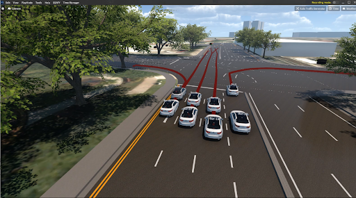
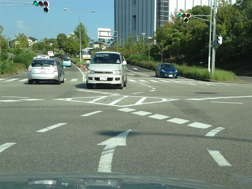
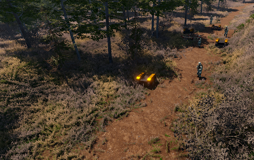
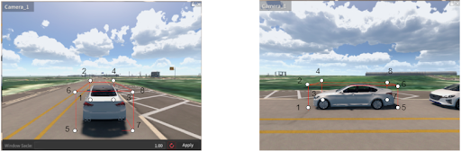
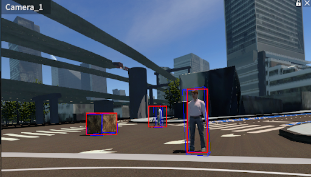
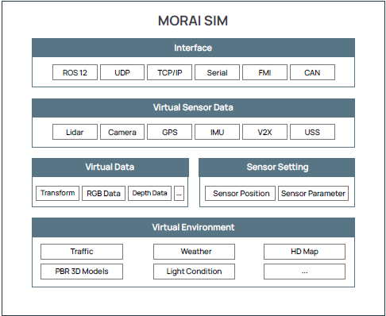
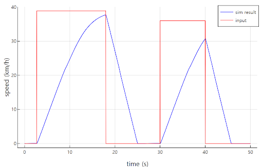

# 업데이트 소식 - SIM Drive 신규 버전 출시
2023년 SIM Drive 신규 버전(버전명: 23.R1.0)이 출시되었습니다.

이번 릴리스 버전, 23.R1.0에는 지난 베타 버전으로 제공한 다양한 기능을 병합하였으며, 기존 정규 버전의 주요 기능을 일부 개선하였습니다.

특히, 교육 및 범용으로 제공하는 기본 프리셋 버전인 SIM Drive ST의 활용성을 높이기 위해 센서, 환경, 시나리오와 같은 시뮬레이터 주요 기능 옵션을 대거 확장하였습니다.

## 주요 하이라이트 
SIM Drive 23.R1.0에 새롭게 추가된 기능 및 개선 사항에 대한 주요 하이라이트는 아래와 같습니다.

  - [맵과 오브젝트 모델 확대](#_3): 일본 도로 교통법에 맞는 맵과 신호등 처리 로직을 포함하여 국방 분야 시뮬레이션 평가에 활용할 수 있는 오브젝트 모델이 추가되었습니다.
  <table>
  <tr>
    <th style="border-right: 2px solid #E2E2E2; padding: 0.5px;"> 
    </th>
    <th style="padding: 0.5px;">
    </th>
  </tr>
  </table>

  

- [카메라 센서의 3D BBox 정답 데이터 제공](#_3d-bbox)
  

  

- [최신 센서 사양을 지원하는 신규 모델 추가](#_4)
  

  

- [보행자 시나리오 개선을 위한 웨이포인트 생성 기능](#_5)
  

  

- [시뮬레이션 환경에 대한 날씨 효과 및 마찰력 옵션 추가](#_6)
  
  
  

- [에이전트 차량 모델의 채터링(떨림) 현상 해결 및 종방향 주행 성능 개선](#_8)
  
  

## 새로운 기능 요약
이번 릴리스에 새롭게 추가된 기능은 아래와 같습니다.

### “맵과 오브젝트의 다양성 확대”
모라이 SIM Drive에서는 디지털트윈 자동화 구축 기술을 적용한 정밀지도(HD Map) 데이터 기반의 3D 맵과 다양한 오브젝트 모델을 제공합니다.

이번 23.R1.0 릴리스에서는 글로벌 표준의 주행 환경과 교통 법규에 맞는 보다 현실감 있는 시뮬레이션을 위한 맵과 오브젝트 모델을 추가했습니다.

첫 번째로, 일본 주행 환경과 교통법에 따른 좌측 운전자(LHT) 맵과 MGeo 데이터를 추가했습니다. 
{:onclick="window.open(this.src)" title="Click view screen" width="70%"}
<figcaption>그림 1. SIM Drive에서 제공하는 일본향 맵 및 주행 경로</figcaption>

기존 MGeo 데이터의 LHT(운전자 좌측)/RHT(운전자 우측) 맵을 구분하고 LHT 맵에 대한 정지선 주행 로직을 추가했습니다. 또한 향후 릴리스 버전에는 ‘비보호 우회전’ 도로 교통법을 지원하기 위한 신호등 처리 로직을 포함할 계획입니다.

{:onclick="window.open(this.src)" title="Click view screen" width="70%"}
<figcaption>그림 2. '비보호 우회전' 교통법이 시행되고 있는 일본 교통 환경</figcaption>

두 번째로, 국방 분야의 자율주행 무기체계 시뮬레이션을 위해 실제 훈련장을 연상케하는 야지맵과 군수용 차량과 더불어 군인, 웅덩이, 철조망과 같은 장애물 오브젝트를 추가하였습니다.
{:onclick="window.open(this.src)" title="Click view screen" width="70%"}
<figcaption>그림 3. 국방용 시뮬레이션을 위한 오브젝트 모델</figcaption>

### “카메라 센서의 3D BBOX 정답 데이터, 최신 센서 모델 지원”
23.R1.0의 카메라 센서에서는 검출 오브젝트에 대한 3D Bounding Box(3D BBox) 데이터를 제공합니다. 

3D BBox 데이터는 4개의 평면 좌표값을 가지는 2D BBox 데이터에 비해 8쌍의 3축 Global 좌표(x, y, z)로 구성되어, 장애물의 위치 정보를 보다 정확하게 파악하기 위한 학습 데이터로 활용할수 있습니다.
{:onclick="window.open(this.src)" title="Click view screen" width="80%"}
<figcaption>그림 4. 카메라 센서에서 검출한 3D BBOX 데이터의 좌표 구성</figcaption>

SIM에서 저장한 2D/3D BBox 데이터는 기본적으로 텍스트 형태로 추출지만, 센서 편집 모드에 추가된 **Viz Bounding Box 2D/3D** 을 이용하면 특정 오브젝트에 대한 2D/3D BBox를 시뮬레이터 상에서 바로 확인할 수 있습니다.
{:onclick="window.open(this.src)" title="Click view screen" width="70%"}
<figcaption>그림 5. SIM Drive의 Viz Bounding Box 2D/3D로 시각화한 2D/3D BBox 데이터</figcaption>

### “정밀 센서의 최신 사양을 지원하는 신규 모델 추가”
자율주행 기술에서는 인지 성능을 높이기 위한 정밀 센서의 역할이 매우 중요합니다.
SIM Dirve는 카메라, 2D/3D 라이다, 레이더, IMU, GNSS에 이르기까지 실제 센서와 동일한 검출 데이터 형식과 통신 방식을 지원하는 다양한 센서 모델을 제공합니다.
{:onclick="window.open(this.src)" title="Click view screen" width="70%"}
<figcaption>그림 6. SIM Drive에서 제공하는 가상 센서 모델</figcaption>

이번 릴리스에서는 자율주행 인지 모델에서 요구하는 각 센서 사양에 맞추어 카메라, 라이다, 레이더에 대한 최신 센서 모델이 새롭게 추가되었습니다.

우선 카메라와 2D 라이다의 경우, 검출 로직은 기존과 동일하나 시뮬레이터 내부적으로 검출 데이터를 가시화하는 그래픽 모델이 추가되었습니다. 

특히, 레이더 센서의 경우, 포인트 단위가 아닌 오브젝트 단위의 검출 방식으로 변경되어, 기존 레이터 모델에 비해 오브젝트에 대한 트래킹 정보를 검출합니다. 따라서 현재 단일 프레임 상의 검출 데이터와 이전에 전송된 여러 개의 프레임 데이터를 비교하여 해당 오브젝트의 속도, 위치 값을 계산할 수 있습니다.

### “보행자 시나리오 개선을 위한 웨이포인트 생성 기능”
SIM Drive에서는 직접 시나리오를 생성하고 수행할 수 있는 빌트인 시나리오 에디터를 제공합니다. 

이번 릴리스의 시나리오 에디터에서는 보행자 이동에 따른 웨이포인트(Waypoint) 생성 기능을 추가하여 보다 구체적으로 보행자 시나리오를 설계하고 수행할 수 있습니다.
{:onclick="window.open(this.src)" title="Click view screen" width="70%"}
<figcaption>그림 7. 빌트인 시나리오 에디터의 웨이포인트 생성 기능</figcaption>

지난 버전의 보행자 시나리오와 비교하여, Waypoint 기능이 추가된 보행자 시나리오 로직은 아래와 같습니다.

| 기존 보행자 시나리오 | Waypoint 기반 보행자 시나리오 |
| :---------- | :----------------------------------- |
| <ol><li style="text-align: left;">Ego 차량이 Activation Distance(m) 내 존재</li><li  style="text-align: left;">Object Setting에서 정의한 보행자 Heading 방향과 Walk Speed(kh/m) 속도로 Moving Distance 만큼 이동</li></ol> | 
 :material-check: 보행자는 Moving Distance 대신 사용자가 설정한 Waypoint를 따라 이동
 <ol><li style="text-align: left;"> Waypoint에 도달하기까지 기존에 정의된 Walk Speed(km/h)로 이동하고 도달하면 각 Waypoint에 정의된 Speed(km/h)로 이동</li> <li style="text-align: left;">Waypoint 도달 후 Pause Time(s) 만큼 대기 가능</li></ol> |

### “시뮬레이션 환경에 대한 날씨 효과 및 마찰력 옵션 추가”
SIM Drive의 시뮬레이션 환경에서는 비, 안개, 악천후의 날씨를 비롯하여 주/야간 시간대에 따른 조도 변화를 설정할 수 있습니다.  
현실에서는 다양한 환경 데이터를 취득하기 어려운 제약 사항이 존재하지만, SIM에서는 현실과 동일한 다양한 환경 조건의 학습 데이터를 매우 간편하게 취득할 수 있습니다.

23.R1.0에서는 보다 현실감 있는 시뮬레이션을 위해 날씨 별 효과 강도 및 도로 마찰력을 제어하는 사용자 옵션을 추가하였습니다.

악천후 날씨의 경우 **Storm, Rainy, Snowy** 효과 강도를 보다 세밀하게 제어하도록 **Effect Strength** 옵션을 추가하였으며 안개 낀 날씨의 경우, **Density** (밀도) 및 **Distance**(간격) 옵션을 추가하였습니다.
<table>
  <tr>
    <th style="border-right: 2px solid #E2E2E2;" > 
    </th>
    <th>
    </th>
  </tr>
</table>
<figcaption>그림 8. SIM Drive 시뮬레이션 환경 구성에 추가된 Effect Strength 및 Foggy Density, Distance</figcaption>

또한 도로에 대한 Multiplier(마찰 계수) 옵션을 추가하여, 눈이나 비와 같은 날씨에 영향을 받을 수 있는 도로면 마찰 강도를 0 ~ 1 사이로 제어할 수 있습니다.

## 주요 개선 사항 요약
이전에 배포된 릴리스(22.R4.0)에서 개선된 사항을 알아봅니다.

### “에이전트 차량 모델의 채터링(떨림) 현상 해결 및 종방향 주행 성능 개선”
Kinematics(운동학)을 포함한 SIM Drive 에이전트 차량 모델에 대해 가속도 제어시 발생하는 채터링(떨림 현상)을 제거함으로써 종방향 주행 성능을 개선하였습니다. 

{:onclick="window.open(this.src)" title="Click view screen" width="60%"}
<figcaption>그림 9. SIM Dirve Kinematics 차량 모델의 기존 종방향 제어 대비 개선된 주행 결과 </figcaption>

#### 🍀 Kinematics 모델이란 
<pre>
  Kinematics(운동학) 모델은 물리적인 힘의 영향으로 가속하여 동작하는 Dynamics(동역학)과 달리, 힘(질량)을 고려하지 않는 차량 모델입니다. 

  자율주행 시뮬레이션에서 Kinematics 모델은 일반적인 Dynamics(동역학) 모델에 비하여 아래와 같은 장점을 갖습니다.
  
  ◾상대적으로 가벼운 연산을 하므로 시뮬레이션에 최적화

  ◾페달 및 브레이크가 없어 가속/감속 제어가 용이, 시나리오 수행 성능이 향상됨

  ◾Low pass filter 적용, 최대 가속/감속도의 제한을 두어 설계했기 때문에 급가속/감속과 같은 불연속 입력에 대한 안정적인 제어 가능
</pre>
